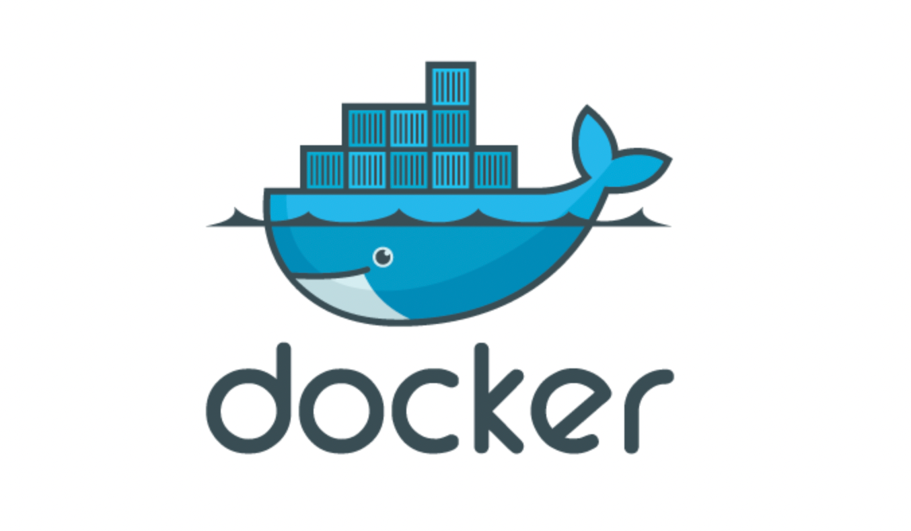
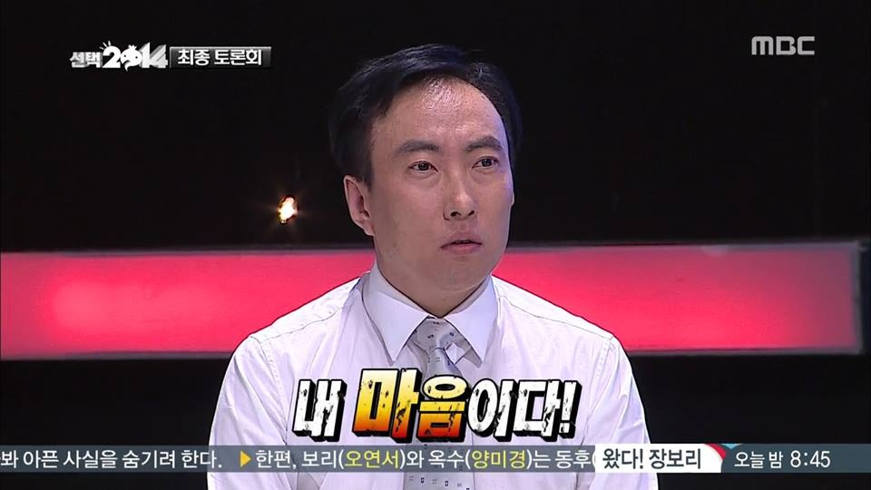

<aside>
❗ 과음한 다음 날부터 쓰기 시작하는 주니어 사원의 2022 회고록.

</aside>
 
 
 

# 2022년도 이렇게 지나갔네요

 

신경 안쓰이는 척은 했지만 무게감은 여느 때와는 달랐습니다.

그게 나이 때문인지 연차에 비해 확연히 늘어난 업무량 때문인지는 모르겠지만,, 🤤

그래도 다양한 면에서 만족도 높은 한 해인 것은 분명합니다.

새롭게 알게된 사람들도 있었고 정신적인 성장도 있었고 개발 능력에도 확연한 발전이 있었(다고 믿고있습니다).

 

다사다난 했던 한 해를 보내며,

올 한해 있었던 다양한 일들을 마무리하는 기분으로 정리하고 싶다는 생각이 들었고,

이렇게 회고를 작성해보는 중입니다.

일, 취미와 생활을 모두 엮어 걸어온 발자취를 되새김질 하면서 자연스럽게 앞으로의 목표까지 이어서 끄적이겠습니다.

 

 

## ‘중용’의 의미

사전적으로 해석하면 지나치거나 모자라지 아니하고 떳떳하며 변함이 없는 상태를 말하는 말이죠.

저는 이 단어를 정말 좋아합니다. 개인적인 해석도 덧붙이자면,

어느 한 쪽에 치우치거나 쏠리지 않게 항상 정성을 다해 노력하는 상태를 나타내는 것 같아요.

 

혹시 물구나무를 연습해보신 분이 있을지는 모르겠지만,

물구나무를 서려면 계속해서 앞 뒤로 흔들리는 균형을 잡아줘야 합니다.

살아가는 방법도 크게 다르지 않은 것 같아요.

일도 생활도 서로 밀고 당기며 균형을 이루고 어느 한쪽으로 치우치면 어딘가 삐걱거리기 시작하죠.

올 한해 저는 이런 삶의 물구나무를 잡기 위해 에너지를 쏟았습니다

 

현재는 일과 생활 사람과 같은 요소들이 적절히 버무려져서 정신적으로 매우 안정되어 있다고나 할까요,,

물론 고민은 많습니다.

앞으로 제가 일하는 부서의 방향성이 좀 더 명확해질 필요도 있다고 생각하고,

운동에 시간을 많이 할애는 하고 있지만 원하는 목표로 가기 위한 훈련을 하고 있지는 않다는 생각도 들어서요.

 

 

그렇지만 그다지 걱정하지는 않습니다.

어차피 내년도 프로 중용러 답게 꾸준히 균형을 잡아나가면서 조금씩 발전시켜 나갈테니까요.

떠오른대로 마구 쓰다보니 글에 두서가 정말 없네요.

이제 진짜 세부회고입니다. 업무 - 운동 - 취미 순으로 정리 해보겠습니다

 

 

 

# 올해에는 이런 업무들을 했어요

짧게 요약하자면 진짜 새로 해야하는 일의 연속이었습니다. 심지어 레퍼런스가 없는 일들이요,,

 

 
우선 제가 일하고 있는 부서의 역할이 독특하긴 합니다. 마치 회사 안의 작은 스타트업
같은 느낌이랄까요.

부서원 구성 또한 개발 경력이 매우 오래된 분들이 있거나 한 것도 아니었습니다.

그 말인 즉, 개발을 진행하는 프로세스 자체가 존재하지 않다는 말이었죠.

사용 기술 스택 또한 매우 뒤쳐져있어 기술 부채가 상당한 상태였습니다.

이런 총체적 난국 속에서 처음 맡은 업무는 개발서버와 관련된 기술부채를 해결하는 업무였습니다

 

 

## Docker와 Container, 그리고 DevOps

그렇게 Docker와 첫만남을 가지게 됩니다.

컨테이너 기반 환경이 기존에 사용하는 VM기반 환경과는 어떻게 다른지 나만 알면 끝나는 것이 아니라,

**\*다른 사람도 사용할 수 있게 유도하는 작업이 필요했죠**.\*(사실 이 부분은 아직 진행중)

Docker를 설치하고 사용하는 일 자체는 어려움이 없었습니다. ~~google과 stack overflow 와 함께라면 뭐든지,,~~

다양한 환경 기반의 container를 docker를 통해 생성 및 관리할 수 있게 되었죠.

그치만 이것만 가지고는 부족했죠,, container가 가진 장점을 극대화하기 위해서는 한 스텝 더 나아가야했습니다.

 

 
사용자 입장에서 자주 쓰고 싶게 만드려면 어떻게 해야할까요? 답은 간단한 것 같습니다.
편하면 됩니다 ㅎㅎ
 

 
그렇다면 container라는 기술을 깊게 알지 못하더라도 쓸 수 있어야 편한거겠죠?

관련 내용으로 공부를 더 해보니 DevOps 라는 개념과 가까워질 수 밖에 없더라구요.

코드 저장소(Git 이라던지, git 이라던지, git 등이 있음)에 코드를 올리기만 하면 서비스가 배포될 수 있다?!

로컬환경에서 테스트해 본 서비스를 다시 서버로 옮겨서 환경을 설치하고,

서버 테스트, 그리고 다시 배포 환경으로 옮겨가고,,, 이럴 필요가 없어지겠죠.

그래서 도입하게 된 툴이 바로 Jenkins 입니다.

그리하여 CI(Continuous Integration)에 한 걸음 더 다가갈 수 있었습니다.

리눅스라고는 ls -al 이나 칠 줄 알았는데ㅋ 어느새 디렉토리의 격리 구조니 프로세스니 씨부리고 있네요 ㅎ

 

 
아무튼 현재는 Docker 와 Jenkins 를 가지고 개발 서버의 CI/CD 환경을 구성한 상태입니다.

수많은 Dockerfile, Jenkinsfile과 사투를 벌였던 기억이 주마등처럼 스쳐지나가는군요.

쿠버네티스 도입 또한 검토했습니다만 어떤 한 서비스가 계속해서 커나가거나 확장되는 상황은 아니기에

검토랑 공부에 그쳤습니다 ㅎㅎ

참고로 한창 공부할 때 정리해둔 내용도 링크는 남겨둬야겠군요.

 
[컨테이너 개발환경](https://www.notion.so/jun9/b2e47373cad94df4b4183ef33d542553?v=e3508b07784f41488fce3c3f387707e0&p=6d430d94d3294cea986956dd59e5b68b&pm=s)
 
그렇게 부서에서의 저의 롤은 DevOps 엔지니어로 굳어가는가 했으나 역시 어림도 없지!

새로운 프로젝트들이 쏟아져 내리더라구요.

 

 

 

## 개발도 하래요!

처음 입사했을 때 제 직무 타이틀은 IT설계 였습니다. ~~대체 그게 뭐하는건데;~~

처음에는 솔루션 아키텍트 같은 느낌으로 이해했는데 짜잔!

‘IT관련 모든 일을 다 할 수도 있습니다 직무’ 였을지는 몰랐던거죠.

현재는 아예 Software 개발로 직무가 고정됐습니다. (타이틀만 개발이지 전부 다 해야하는건 비밀입니다)

 

뭐가 먼저였는지는 기억이 가물가물 합니다만 동시에 여러가지를 진행했기에 순서는 중요하지 않은 것 같네요.

우선 AI 태스크포스에 편성되어 AI 기능개발을 진행했습니다.

파이썬 및 주피터 노트북을 사용했고, 수많은 데이터를 보면서 개인적인 관점을 더하는 작업이 필요했습니다.

그리고 깨달았죠. 와! 진짜 ㅈㄴ 재미없다!

 

 
애초에 순서가 잘못되었다고 생각하는게,

어떤 서비스에 AI가 도움을 줄 수 있는 기능 개발을 한 것이 아니라 AI를 가지고 뭐든 개발해라 였거든요.

그러다보니 프로젝트 오너쉽을 가진 쪽에서는 억지로 짜맞춰서 AI 프로젝트 아이디어를 낼 수 밖에 없었고,

데이터에 관점을 더하는 작업이 수월하게 진행될 수가 없었습니다.

이는 사실상 노답 프로젝트라고 밖에는 할 수 가 없겠네요 ㅎㅎ

이렇게 처음으로 실패한 프로젝트가 어떤 것인지 겪을 수 있었습니다. 매우 소중한 경험! ~~내 탓은 아님!~~

 

하지만 배운 점은 많았습니다. 가장 중요한 것은, ~~꺽이지 않는 마음~~ 이 아니라 휘둘리지 않고 소신껏 자기 생각을 공유하고 설득해야한다는 것이었습니다.

저연차 사원인데다가 과장 부장들 틈사이에 껴서 진행된 프로젝트라 제 의견을 많이 내세우지 않았었는데,

이는 큰 오산이었습니다. 저 때 이후로 제 생각을 명확하게 전달하고 의견을 피력하고자 많이 노력합니다.

 

그 다음으로는 현재 진행되는 과제의 관리자용 web개발 건이 있었습니다. (사실 동시에 했습니다 ㅎㅎ)

마침 스스로 생각하기에 자바스크립트를 다룰 줄은 알았지만 프론트엔드 framework 사용경험은 부족했기에

이 과제를 해나가면서 부족한 부분을 채워야겠다고 생각했습니다.

동시에 부서에서 사용하는 main 프론트 framework를 React로 옮기고자 하는 사악한 속셈도 있었습니다.\_

마침 새로 들어오신 분이 react 기반 개발에 능숙한 상태였어서 배울 점도 많았구요.

연말이 되어 그 때 짠 소스코드를 보면 경악스러운 부분이 많긴 했지만, 시간 난 김에 리팩토링도 했으니 머,,

목적 달성에는 굉장한 도움이 되었다고 할 수 있겠네요 ㅎㅎ

이제 어느정도 React 사용에는 익숙해졌으니 내년에는 좀 더 심화로 들어가볼 생각입니다.

 

세번째로 다뤘던 것은 어쩌면 React랑 크게 다르지는 않다고 할 수는 있겠네요.

React Native 기반의 크로스 플랫폼 모바일 App 프로젝트였습니다.

이 프로젝트를 처음 시작할 때, 요청 부서나 저희 쪽 반응이 뭐랄까,,

보여주기 식으로 만들고 치우자! 였어서 현타가 좀 왔던 기억이 나네요,, 🤦

하지만 같은 팀원들과 많은 얘기를 했고, 그렇다면 우리한테라도 의미 있는 프로젝트를 만들기로 결정합니다.

실제로 부서의 개발 프로세스 전반을 정의하는 초석 역할을 해줬고, 개인적으로도 너무 즐겁게 작업했습니다.

 

-새롭게 도입했던 것들-

🆕 figma를 사용한 WireFrame 기반 개발 기획

🆕 프론트엔드 디자인 패턴(controller/presenter) 정의

🆕 Git을 사용한 개발 업무 분배 및 공유

🆕 배포 버전 관리

이제 내년에는 이렇게 도입된 방식을 널리 퍼트리는게 목표입니다.

(널리 퍼트리는 방법 : 이렇게 쓰라고 협박하기)

 

 
업무적인거 말고도 회사에서도 다양한 경험을 했습니다 ㅋㅋ 뭔 사내방송도 출연함 ㅋㅋㅋㅋㅋ
 

 그 밖에도 여러가지 손댄 것은 많았습니다만, 너무 길어지면 또 재미없으니
그만,,

최근에는 NodeJS 기반의 백엔드 개발을 진행하고 있습니다.

너무 많은 걸 하고 있는게 아니냐구요? 네 맞습니다.

더 깊게 알고 싶다고 생각한 부분은 많은데 핑계를 대자면 그럴 시간이 부족했던 것 같아요.

그래서 내년엔 좀 한쪽으로 깊어지는게 목표입니다 하하

 

팀 적인 목표도 적어보자면,, 좀 더 단합된 개발 조직으로 만드는게 제 목표입니다.

짧은 시간 안에 기술 부채를 해결하다보니 이를 못 따라오는 인원들도 있고,

~~본인의 에고 때문에 안 따라오는 사람도 있게 되더라구요.~~

아무튼 하하 꽤나 어려운 도전이 될 것 같지만 가장 중요한 일이겠네요.

 

 

## 아무튼 일 많이함

신문물이 난무하는 한 해였습니다. 근데 아직도 부족해요! 부채는 쌓여가는거니까요 ㅎ

내년에는 또 어떤 쪽으로 역량을 늘려갈 수 있을지 기대가 됩니다.

 

 

 

 

# Calisthenics를 해요! 아 그게 뭐냐면 맨몸운동이요.

새로운 사람을 만날 일이 많았어서 그런지 취미 얘기를 할 일이 많았습니다.

그래서 생각해봤더니 저 문장을 제일 많이 말한 것 같네요 ㅎㅎ

그렇지만 맨몸운동이라고 하면 주로 크로스핏 계열의 버피 같은 걸 생각하시는 경우가 대부분이라

항상 잊지않고 사진자료 등과 더불어 추가 설명을 해드리는 편입니다^^

 

시작은 작년 6월 부터 였던 것 같습니다.

코비드19로 헬스장이 문을 닫고, 남는 시간을 생산적으로 보내고자 공원에서 철봉을 잡은게 첫 시작이었습니다.

철봉 잘하는 법을 찾아보다 알게된 인생운동! 🤸

올해 여름까지만 해도 퇴근하고 매일같이 집앞 근린공원에 있는 철봉을 찾아갔습니다.

프론트레버, 백레버와 같은 동작을 연습했고 성과도 꽤 있는 편이었죠!

 

 

 

8월에 신림으로 이사를 오게 됐는데, 큰 문제가 발생합니다.

근처에 멀쩡한 철봉이 없어요 ㅜㅜ 그래서 결국은 다시 헬스장을 다니고 있습니다,,

겨울이라 오히려 잘된 걸지도,,? 근데 아무래도 헬스장에는 저런 동작 연습할만한 기구가 없어서 좀 불만입니다 ㅜ

현재는 헬스장에서 기본적인 근력과 맨몸 기초운동(풀업,딥스,어꺠운동) 위주로 운동 진행중입니다.

**하지만 아무래도 동작연습 하고 싶다,,!**

내년은 헬스장이 아니라 실내에서 저런 운동을 할 수 있는 장소를 찾아보려구요!

집에서 플란체 연습도 시작은 했습니다만 아무래도 집이 좁아서 다이내믹하게 하지는 못하는 중입니다

내년에는 스트래들 플란체까지 성공해 보는게 소박한 목표,,

 

 
그래도 같이 맨몸운동하는 친구가 있어서 운동하러 돌아다니다가 준명신 영접도 해봤네요.
 

 
이제는 운동은 뭔가 동기부여를 얻어서 하는 느낌은 아닙니다.

규율에 가깝다고 해야하나,, 인생을 더 잘 끌어나가기 위해 ‘일’의 반대쪽 힘을 주는 느낌인거죠.

아무튼 운동도 조아! 🙆‍♂️

 

 

 

# 취미가 뭐에요?

사실 운동이 일상의 영역으로 넘어간 이상, 뚜렷하게 이게 취미다!라고 말할 거리가 없어지긴 했네요.

뭐 좋아하는 건 많습니다.

- 아스날 축구경기 보기
- 음악 듣기(특히 최신 팝송 중 좋은거 찾기, 꽂힌 노래 무한반복하기)
- 게임(에이펙스 레전드 only)하기
- 축구를 직접 하는 것도 좋아함
- 책 읽는 것도
- 음악 연주하는 것도

음악 듣기 하니까 생각난 건데 혹시 유튜브 뮤직 쓰시는분들 중 Recap 기능 이용해보신 분?

저는 이 서비스 정말 좋아합니다.

 

 

 
2022 취미 결산 같은 느낌이라 새롭더라구요 ㅎㅎ 다른 플랫폼도 이런 서비스 많이 나왔으면
ㅎㅎ

 

 

## 좋아하는 건 생기기도 하고 없어지기도 하니까

올해들어 비중이 많이 줄어든 취미도 있고, 비중이 늘어난 취미도 있는 것 같네요.

특히 게임 비중이 꽤나 많이 줄어들었고, 축구를 직접 하는 것도 그렇습니다.

아 가장 줄어든건 음악을 연주하거나 만드는 일인 것 같아요.

할애하는 시간이 줄어들었다는 건 그만큼 다른 일에 시간을 쓴다는 말이겠죠?

새로 좋아하는 일은 음,, 와인 마시기도 꽤나 흥미가 생긴 것 같고, 맛있는 음식 찾아서 먹어보는 일이나 새로운 서비스 나오면 체험해보기?

취미 마저도 중간을 유지하는 프로 중용러입니다. ~~쌉소리입니다~~

 

 
취미는 뭐 살아가는 데 있어서 조미료 같은 역할을 하는거니까요

앞으로도 재밌는게 생기고 또 재밌었던게 없어지기도 하겠죠.

다양한 걸 경험해보고 즐기다보면 어느 상황에서는 도움이 되는 일도 있더라구요.

진짜 재밌어지면 운동처럼 삶의 균형을 잡는 역할까지 올라갈수도? 뭐 암튼 그렇습니다

 

인간관계에 쏟은 시간도 상당하다보니 개인적인 취미에 쓰는 시간도 줄었던 것 같아요.

사람 많은걸 꺼려하는 극I지만 새로운 자극이 되는 즐거운 시간들이었습니다.

애초에 저질러놓고 후회를 하는 성격도 아니지만요.

인간관계에 대한 기조는 내년에도 동일할 것 같습니다.

감정이든 일이든 저에게 도움이 되는 만남을 더 좋아할 것이고 도움이 안되는 만남은 줄어들겠죠.

~~좋은게 좋은거다는 없음~~

 

 
취미 쓰다가 딴길로 잠깐 샌 것 같은건 기분 탓입니다.

 

 

 

# 쓰고 보니 넘 많이 씀

무튼 이렇게 간단하게 올 한해도 정리해봤습니다. ~~이게 간단하다고?~~

남은 날들도 무탈하게 잘 보내고 싶고 다가올 새해도 기대가 많이 되네요.

이 글을 보시는 분들도 올 한해 마무리 잘 하시길 바라며 내년에도 즐거운일 가득하시길 바랍니다. 🌅

 

 
