## ✅ 생성형 AI 강의 목차

1. AI에 대한 오해 풀기 - AI가 할수있는 영역 구분하기
   1. AI는 자동화가 아니다
   2. AI는 정답을 알려주지 않는다
   3. LLM은 뭐가 좋은건가?
2. 실제 할 수 있는 작업들 보여주기(생략)
   1. 예시1
   2. 예시2
   3. 예시3
3. 회사에서 LLM을 도입하는 방법

---

 
 

AI를 어떻게 써야 하는지에 대해 다들 많은 고민을 하고 계실 것 같습니다.

 
오늘은 그런 니즈를 조금이나마 해소해드리고자 마련한 자리이며 AI는 어떻게 활용해야하는지,

요즘 핫하다는 생성형 AI는 뭔지 조금이나마 이해시켜 드릴 수 있는 시간이 되었으면 좋겠습니다.

 
먼저 AI에 대한 오해를 먼저 풀어드리고자 합니다.

좋은 도구를 잘 쓰기 위해선 어디에 쓸 수 있는 도구인지를 먼저 알아야겠죠?

 
 
## 1. AI에 대한 오해 풀기

### -AI는 자동화가 아니다

 
가장 먼저 말씀드리고 싶은건, AI는 자동화와 완전히 다른 개념이란 것입니다.
 
그렇다면 AI는 뭘 해주는 걸까요?
 
AI 모델이 제공해주는 건 인간이 한번에 처리하기 힘든 정도 양의 데이터를 분석한 결과일
뿐입니다.
 
 
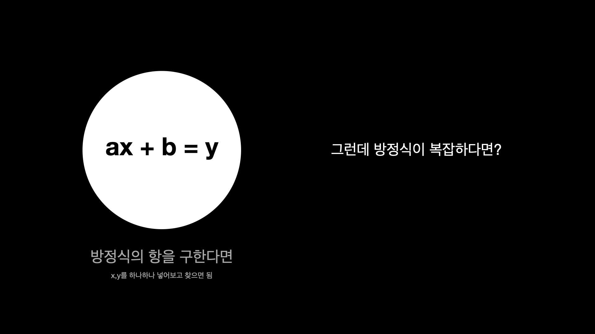
 
다들 수학 공식을 정말 오랜만에 보셨을 것 같은데,, 간단한 수학 공식으로 AI를
설명드리면 좋을 것 같습니다
 
지금 보이는 저 식에서 a와 b를 '방정식의 항'이라고 부르는거 기억하실까요?
 
아무튼, 방정식의 항인 a,b 값을 찾고 싶다면 어떻게 해야할까요?

맞습니다 모르는 수학문제 풀듯이 x,y를 하나하나 넣어보면서 찾으면 됩니다.

그런데 이 방정식이 엄청나게 복잡하다면 어떨까요?

 
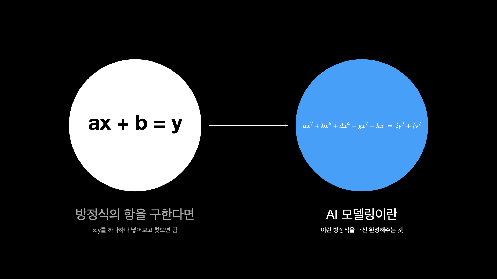
 
이런 상황에서 사람이 하나하나 입력하는게 가능할까요?
 
불가능하기 때문에 사람은 이걸 대신 해주는 방법을 찾아냅니다. 그게 바로 AI 모델링입니다.
 
x,y에 대한 값을 여러개 제공하고 이 방정식의 항, a,b,d 등등 을 찾아내는 과정. 이걸
저희는 AI 모델링이라고 합니다.
 
이렇게 완성해낸 공식(모델)에 사용자가 새로운 x 값을 넣어 y 출력을 제공받는게 AI가
동작하는 방식입니다.
 
x라는 입력값을 넣었을 때 y라는 출력값이 나오게 만드는 도구라는거죠.
 
 
사내에서 교육을 받다보면 이 수학 공식들을 만드는 과정을 어떤 프로그램들을 써서
진행하고,
 
잘 모르는 상태에서 보면 뭔가 자동으로 해결되는 것 같고 그러다보니
 
AI와 자동화를 마치 같은 개념처럼 혼용하여 사용하는 오해가 발생하기 쉬운 것
같습니다.
 
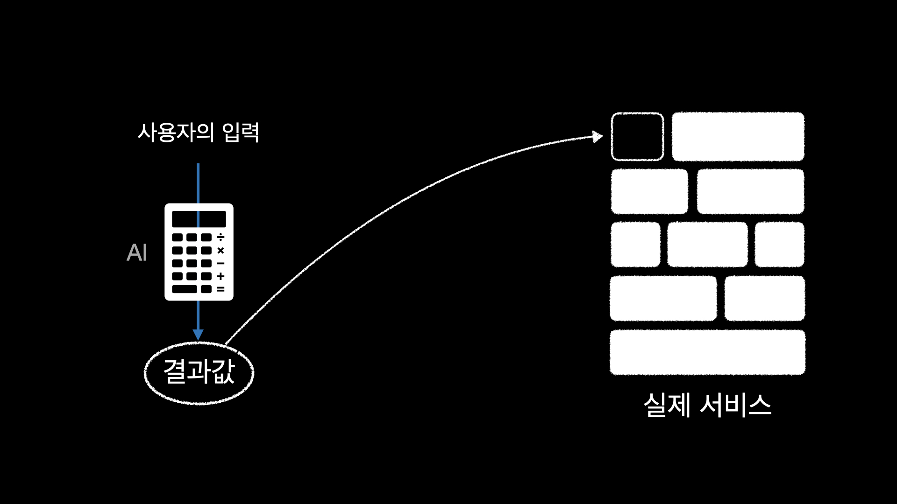
 
자동화를 위한 과정을 설계하고 이를 구현하는 역할은 전부 인간이 하는 부분이며,
 
AI가 뱉어낸 결과를 이 과정에서 활용할 뿐인거죠.
 
 
### -현재의 AI는 정답을 알려주지 못한다

많이 들어보셨을 AI '예측' 모델을 예시로 들면,

용어만 봤을 때 AI가 이후 결과를 '미리 보여줄 것' 이라 생각하기 쉽습니다.

 
그러나 이는 사실 사람이 하는 예측 프로세스와 크게 다르지가 않습니다.
 
저희도 경기결과를 예상하거나 앞으로 일어날 일들에 대해 말할 때 개인의 경험에 기반해서
말을 하지 않나요?
 
그리고 대부분의 경우 예측 결과는 좋지 않죠 ㅎㅎ
 
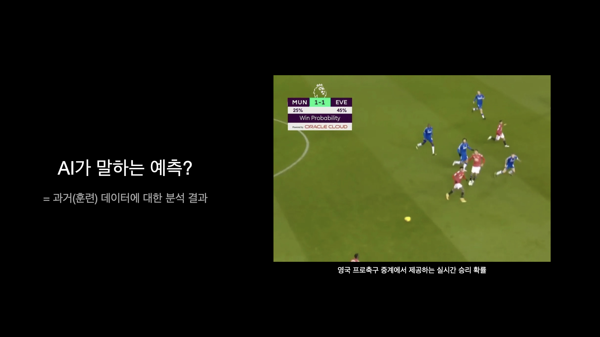
 
AI 분야에서 말하는 '예측'이라는 말의 뜻은 과거의 데이터에 대한 분석 결과로 이해하는게
더 정확합니다.
 
요즘 해외축구 중계 화면을 보다보면 지금 처럼 실시간 승리 확률을 제공해주고는 합니다.
 
그런데 어떠신가요? 이걸 보면서 정말 정확하다! 라는 생각이 드시나요?

저는 보자마자 저런 예측은 나도 하겠다 라고 생각하긴 했습니다 ㅎㅎ

 

 
하지만 이렇게 생각해보면 어떨까요?
 
지금 보여주는 승리 확률 예측이 보여주는건, 과거의 기록을 봤더니 이 상황에서 이긴
경우는 몇 퍼센트 정도더라~
 
 

 
자 다시 앞에서 보여드렸던 7차 방정식입니다.
 
이렇게 이미 완성된 공식에 입력값 x를 넣었을 때 원하는 y를 전부 얻을 수 있는
공식이 있을까요?
 
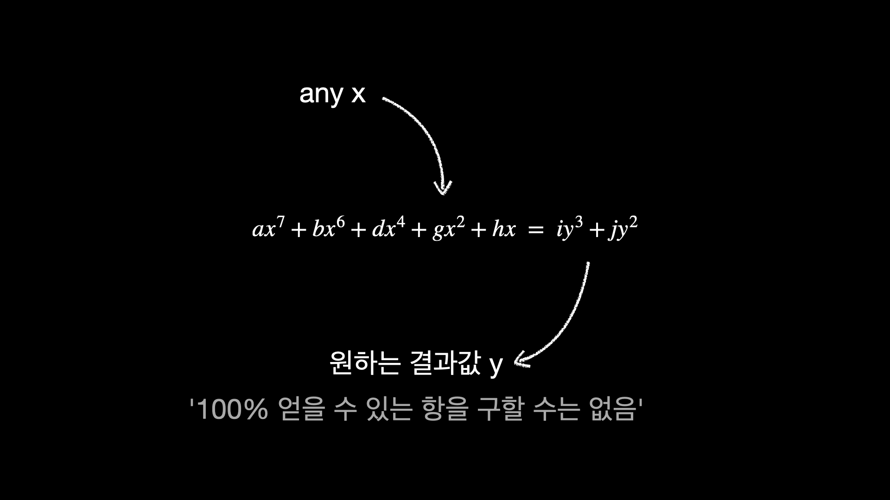
 
식이 방대해지고 정교해짐에 따라 100% 근처로 갈 수는 있지만, 100이 될 수는 없을
겁니다.
 
현재의 AI는 100 근처도 못가는 수준이구요. 다시말해 AI는 '정답을 알려줄 수
없습니다'
 
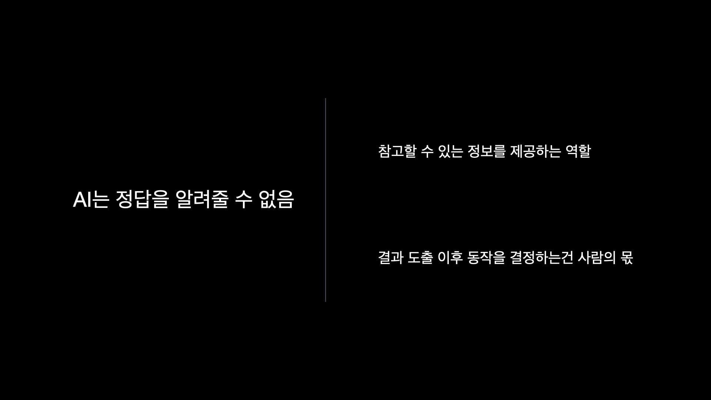
 
정답을 알려줄 수 없기 때문에 판단 또한 내릴 수 없습니다.
 
100에 꽤나 근접하는 AI의 등장을 AGI라고 얘기하곤 하는데,

이런 특이점이 오기전까지는 AI가 직접 판단하게 하는건 너무나 위험부담이 큽니다.

 
단지 기존의 데이터를 분석해보았더니 이럴 가능성이 있습니다. 참고하세요! 하고 정보를
주는 역할을 할 뿐이죠
 
AI가 도출한 결과값을 기반으로 이후 동작을 실행하는 시스템이나 자동화 프로세스를 구현하는건
오롯이 사람이 하는 일입니다.
 

 
실제로 IT 산업을 비롯한 기타 산업에서 AI를 성공적으로 활용하는 모습을 보면, LLM이
등장하기 이전에 가장 활발히 연구되고 실ㅇㅇ적으로 사용된 분야는 어디일까요?
 
바로 컨텐츠 추천 모델 분야입니다.
 
넷플릭스, 뮤직 플레이어 등에 도입되어 개인의 선호도를 분석해서 컨텐츠를 추천해주는
시스템이죠
 
그런데 이 추천을 받고 와 정말 AI가 나를 잘 알고있네! 하는 생각이 들어본적 있으신가요?
 
저도 그런 느낌을 받은 적이 거의 없습니다. 하지만 참고하는 용도로는 많이 활용합니다.
 
이런 현실은, 'AI는 결정에 도움을 주는 조력자 역할을 하는구나' 라는 걸 알려줍니다.
 
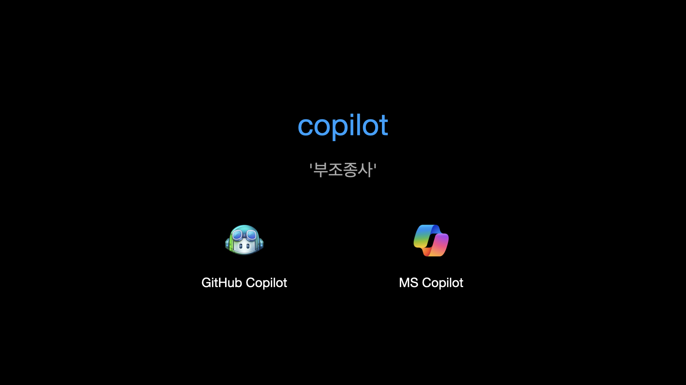
 
생성형 AI가 등장한 이후에도 상황은 동일합니다.
 
대부분의 AI 서비스들이 코파일럿이라는 타이틀을 가진 것도 다 같은 관점입니다.
 
 
### -LLM은 뭐가 좋은걸까?

 
아니 그렇게 AI가 별로면 LLM은 대체 뭐가 다른건데? 하고 물어보실 것 같네요
 
LLM은 생성형 AI 전용 모델이라고 이해하시면 편합니다.
 
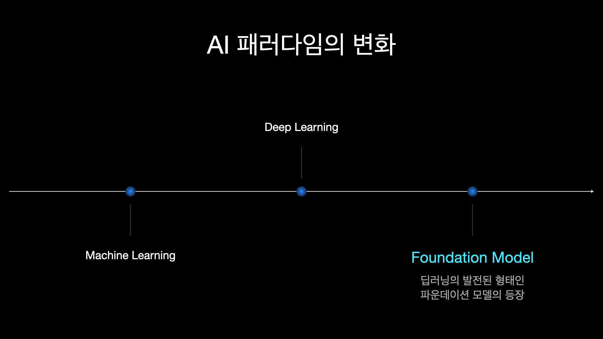
 
머신러닝, 딥러닝 이런 얘기는 지나가면서 얼핏 다 들어보셨을 것 같은데,
 
2018년 구글에서 발표한 BERT라는 언어모델 이후로 딥러닝은 파운데이션 모델이라는 형태로
발전합니다.
 
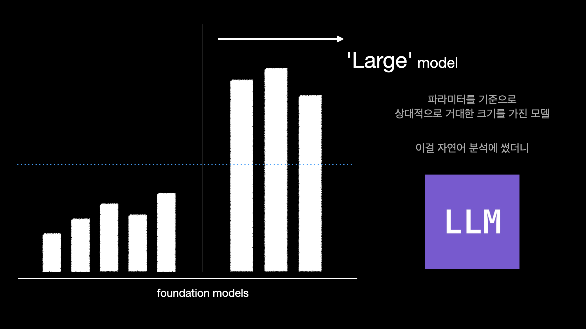
 
그리고 이런 파운데이션 모델 중에 파라미터를 기준으로 상대적으로 거대한 크기를 가진
친구들에게 Large라는 수식어를 붙이게 되었고
 
이걸 자연어 처리에 사용했더니 LLM(Large Language Model)이 됩니다.
 
이렇게 등장한 LLM을 여기도 써보고 저기도 써보니 재밌는 결과들이 나오기 시작한거죠.
 
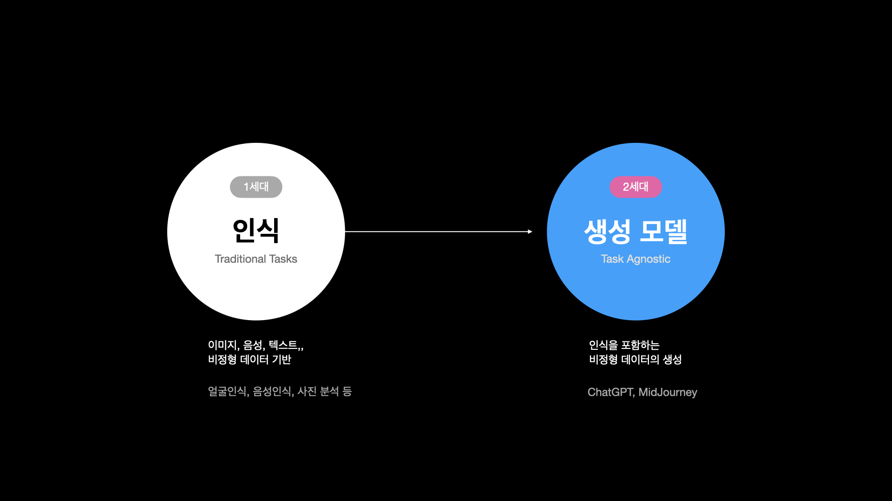
 
딥러닝이 발전함에 따라 AI가 본격적으로 활용된 분야는 이미지, 텍스트, 음성과 관련된
비정형 데이터를 인식하는 분야였습니다.
 
인식에 그치던 기술이 LLM으로 발전하면서 인식을 포함한 생성의 영역까지 나아가는 현상이
발생합니다.
 
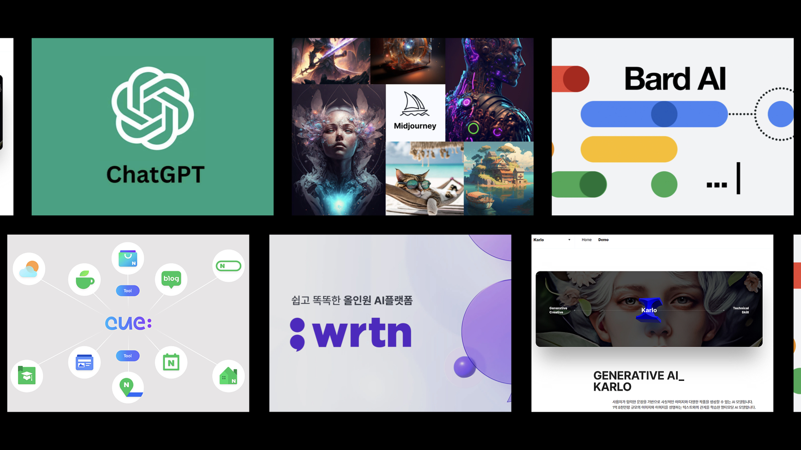
 
그 결과로 저희가 접할 수 있는 기술이 바로 ChatGPT 라던지, MidJourney와 같은 AI들인거죠.
 
이런 모델의 변화들을 관찰해보니 LLM은 이전의 자그마한 모델들과 다른 점이 관측됩니다.
 
 
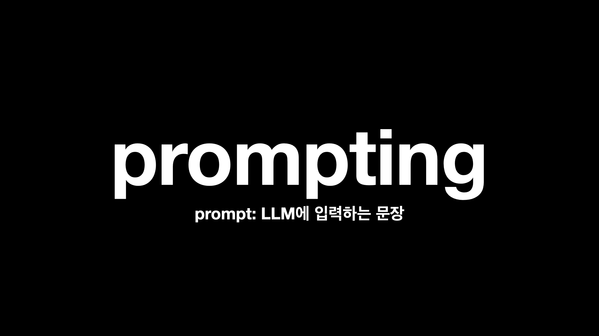
 
모델에 추가 학습을 진행하지 않고, 입력값만 잘 만져도 결과물의 퀄리티가
향상된다는 점이었습니다.
 
이를 전문가들은 prompt를 입력하는 방식이라 해서 prompting이라고 부르기
시작합니다
 
이는 모델의 성능을 개선하기 위해 추가적인 학습을 진행하여 성능을 개선시켜야했던
AI 기술이 가진 진입장벽을 획기적으로 낮추게 됩니다.
 

 
이 특성이 등장함으로써 AI를 이해하지 못하더라도, 질문하는 방법만 익혀도 답변을
개선할 수 있게됩니다. 사용자가 사용하기 쉬워진 것이죠.
 
따라서 프롬프팅의 영역에서도 다양한 연구가 시작되고 사용자들끼리 경험을 나누기
시작합니다.
 
이로써 LLM의 등장 이후로 비정형 데이터의 생성과 관련된 일들을 처리하기가
이전보다 쉬워졌습니다.
 
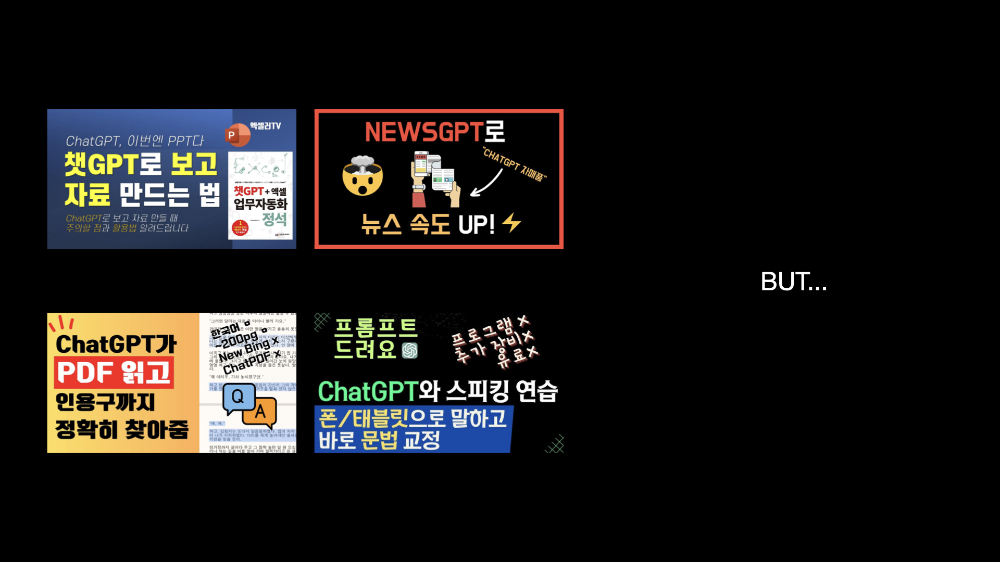
 
이전에 AI는 정답을 알려주지 않는다고 말씀드린거 기억하시나요?
 
AI의 이런 특성과 LLM의 사용방식을 고려하면, 개인적인 업무 효율 향상을 위해
생성형 AI를 사용하는 방안은 주로 문서 작업과 같이 정답이 없는 활동들이
대부분입니다.
 
chatGPT와 같은 툴들을 사용하는 방안들이 데이터 분석, 보고서 작성, 메일 작성,
회의록 작성 등 문서 업무에 소요되는 시간을 줄이는 방법인 이유이기도 하죠.
 
그럼에도 불구하고 아직 까지도 LLM들이 아직 인간의 퍼포먼스 성능에 한참 미달하는,

다시 말해 잘 풀지 못하는 작업들이 즐비하다는 사실을 간과해선 안됩니다.

 
 
 
## 2. 기업에서 LLM을 도입하는 방식

마지막으로 기업에서 LLM, 생성형 AI를 도입하는 방식에 대해 소개해드리겠습니다.

 
 
### -맞춤형 LLM 모델 개발

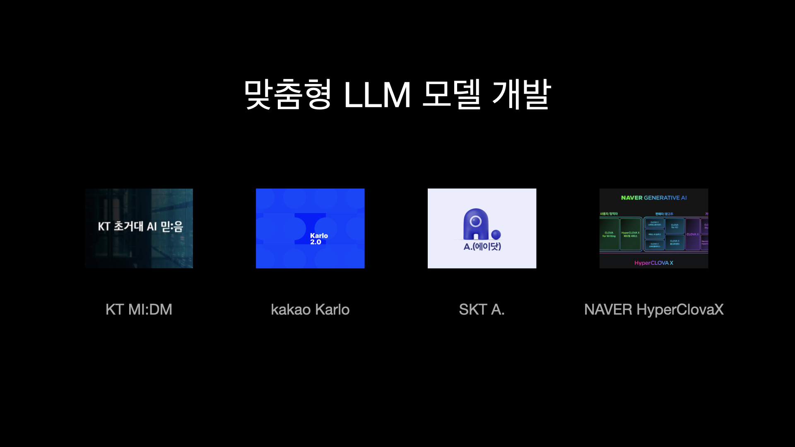

 
이 방식은 초기 데이터 부터 영향력을 행사하고 기업의 입맛에 맞는 LLM을 기초부터 구성할
수 있다는 장점이 있습니다.
 
다만, 학습을 위한 데이터셋을 초기부터 하나하나 구성하는 작업에 많은 시간과 인력이
투입되며,
 
학습을 진행할 인프라를 자체적으로 구축하는 비용도 상당히 크다는 점을 감안해야합니다.
 
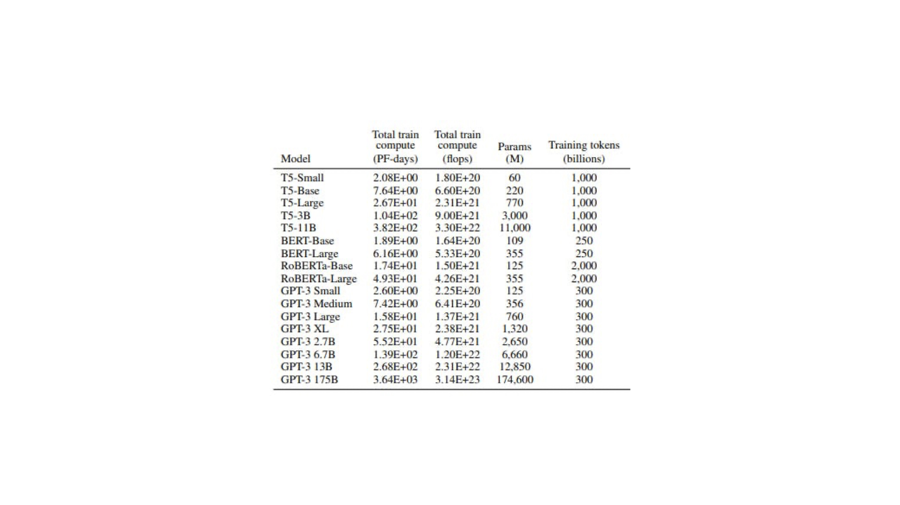
 
gpt3 모델을 기준으로 모델의 크기를 말씀드리면, 모델 파라미터는 1750억개이며, 학습
토큰은 3000억개, 한 번의 학습을 azure 클라우드 비용을 기준으로 환산하면 약 115억정도입니다.
 
LLM이 다양한 일을 능수능란하게 처리하는 것처럼 보여도 결국에는 초기 학습 데이터의
분포가 어떤가에 따라 아웃풋의 퀄리티가 달라집니다.
 
그렇기에 엄청난 비용을 감안하더라도 기업에서 도입을 고려하는 방안입니다.
 
 
### -클라우드 PaaS 도입

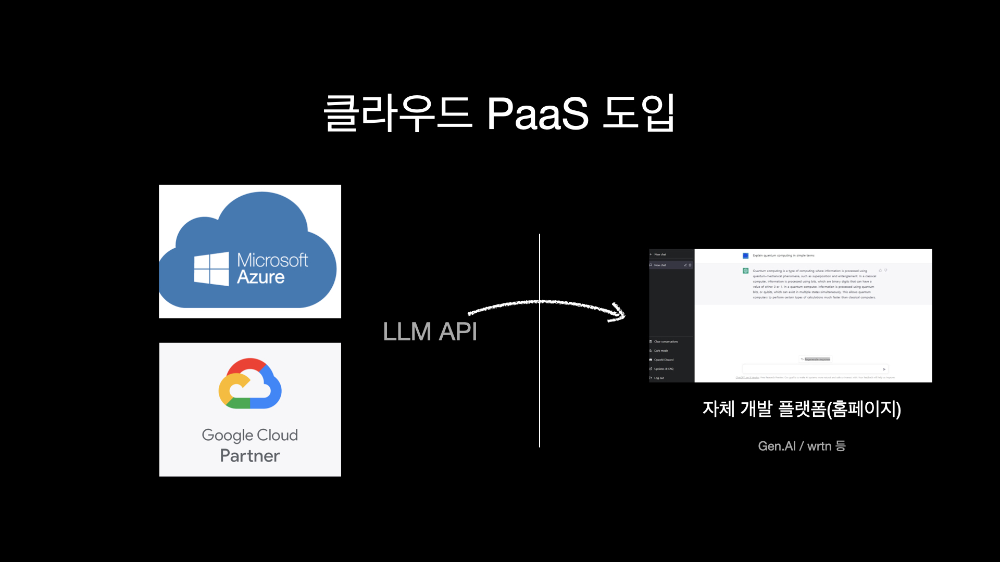

 
두번째 방법은 Microsoft Azure, GCP와 같은 CSP에서 제공하는 생성형 AI 서비스를 사용하는
방법입니다.
 
입력값에 대한 출력값을 제공하는 API를 유료로 사용하게 되며,

기업의 요구조건에 따라 폐쇄망에서 모델을 제공받습니다.

 
이를 출력해주는 플랫폼을 구성하는 건 사용자의 몫입니다.
 
하지만 이런 단순도입은 일반 사용자가 클라우드서비스를 사용하는 방식과 차이가 없습니다.
 
따라서 기업은 이렇게 도입한 LLM의 기능을 확장해서 사용하고자 합니다.
 
 
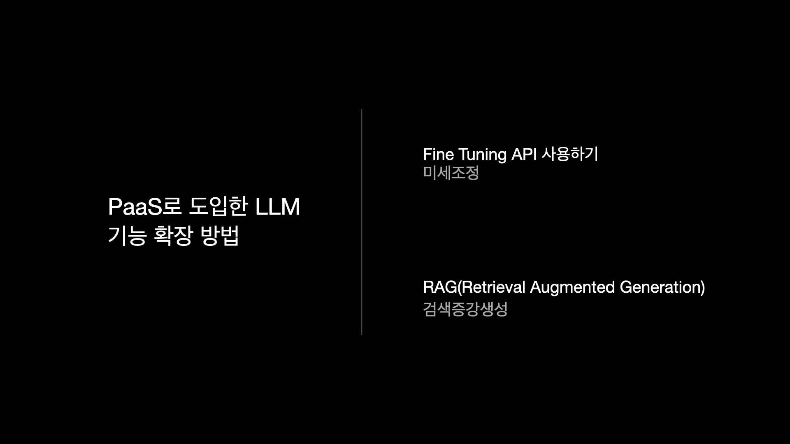
 - 미세조정 방식

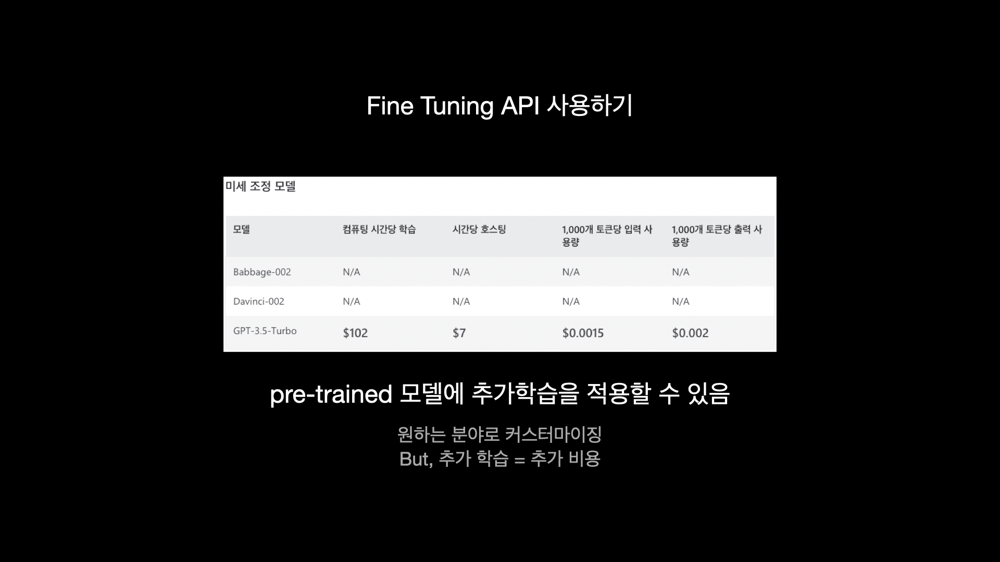

 
이미 완성된 gpt와 같은 사전훈련된 모델에 추가적인 학습을 진행할 수 있도록 제공하는
서비스입니다.
 
이를 fine tuning이라 하며, 학습에는 추가 요금이 필요합니다.
 
특정 도메인 지식에 대한 전문성을 더할 수 있기에 다양한 기업에서 고려하는 방법이기도
합니다.
 
다만, 학습 정보의 퀄리티와 방식 차이에 따라 정보가 너무 한정되어버려 답변 수준 자체가
떨어져버리는 경우가 발생하기도 합니다.
 - RAG

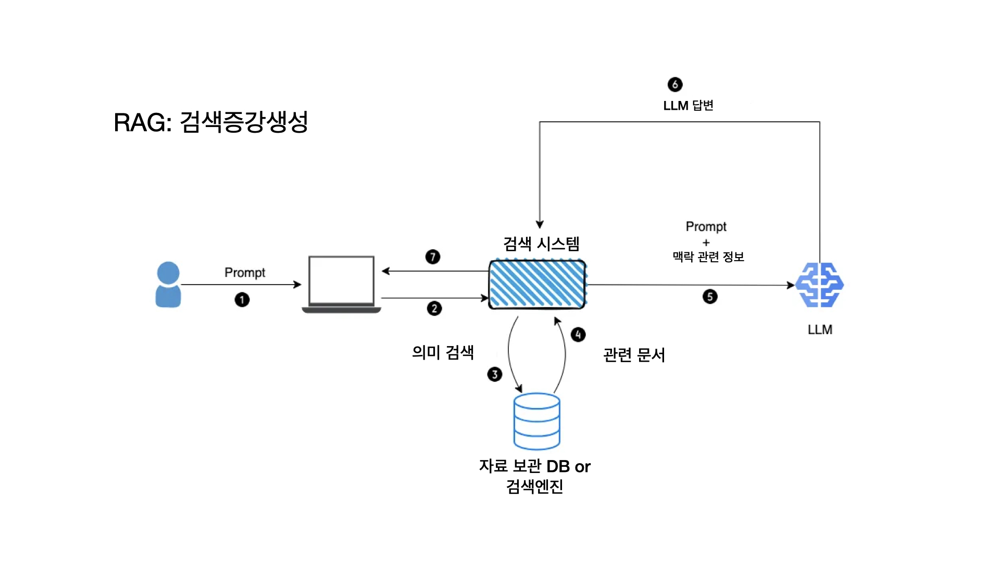

 
다음은 검색증강생성입니다.
 
검색 시스템과 LLM을 결합하여 응답을 도출해내는 방식입니다.
 
간단히 말하면 이 방식은 LLM에 질문을 입력하기 전 외부 리소스(DB)에서 관련도가 높은
응답을 우선적으로 도출하고,

DB내 검색 결과와 질문을 통합하여 프롬프트로 만들어 LLM의 응답을 유도합니다.

 
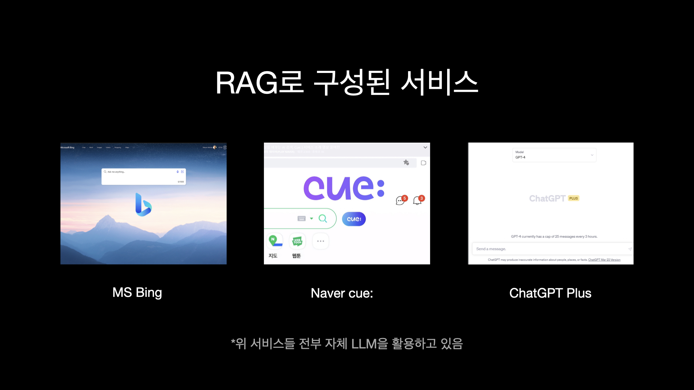
 
MS Bing 또는 네이버 CUE 와 같은 서비스들이 비슷한 형태를 띄고 있습니다.
 
유료버전으로 제공되는 챗지피티 또한 해당 기술을 통해 응답 성능 자체를 개선하고 있기도
합니다.
 
다만 이 서비스들은 자체적으로 구성한 LLM을 사용합니다.
 
최대한 깊게 들어가지는 않으려 했는데 어땠는지는 모르겠네요,,
 
아무쪼록 업무 활용에 도움이 됐으면 좋겠습니다
 
