# 시간에도 가속도가 붙나 봅니다.

 

벌써 23년이 다 지나가버렸습니다. 이럴수가!

아인슈타인이 말한 것처럼 ‘시간은 상대적이다’라는게 이런 느낌이 아닐까요? ~~헛소립니다~~

올해도 작년처럼 수많은 일들이 일어났습니다.

추구하는 방향과는 조금은 다르게 흘러간 일도 많았고, 오히려 추구하지 않은 방향으로 갔더니 좋은 결과를 얻기도 했네요.

정신없던 사건들을 정리하고 넘어가지 않으면 아무것도 얻지 못할 것 같은 마음에 올해도 회고를 작성합니다.

 
제가 제일 좋아하는 **중용**의 관점으로,

어려움을 겪었던 일과 - 그일로 인해 발생한 즐거웠던 일을 엮어서 풀어내보고자합니다.

이 과정에서 제가 잘했던 점과 반성할 점도 떠올려보면서 내년을 위한 준비에 들어가겠습니다.

 
 
 

# Log 1. 회사와 개인

 

뿌리 깊게 박힌 관습은 뽑을 수 없는걸까? 라는 고민을 많이 했습니다.

여느 때와 다름없이 커리어리에서 이런 저런 포스팅을 보던 도중 제 눈을 사로잡은 글이 있었습니다.

대충 ‘부서의 안좋은 문화를 바꾸고 싶습니다. 어려울까요?’ 이런 내용의 질문이었는데,

이에 대한 답변은 ‘넵 절대 바뀌지 않습니다’ 였습니다.

어린시절부터 레지스탕스 정신 충만한 저는 속으로 그건 님 생각이고~를 시전하며 대수롭지 않게 넘어갔더랬죠.

 
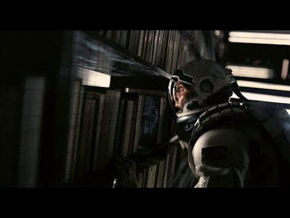
 

그런데 왠걸 ㅋㅋ

작년에 이어 회사에서 야심차게 추구하던 개발 체계 정립과 관련된 일들이 모종의 파도를 만나니 뜻대로 진행이 안되더라구요,,

올해 초까지만 하더라도 정립된 개발 체계를 기반으로 일의 속도감이 높아지겠다는 기대로 들떠 있었는데,

팀장님이 바뀌고 팀이 가야할 방향에 대한 공감이 이뤄지지 않으니 ~~벽에다 말하는게 더 소통이 잘되는 기분이었습니ㄷ~~

다른 방향의 일에 비중이 더 커지더라구요.

그렇다고 개발을 열심히 할 수 있었냐? 이것도 아니었습니다 ㅋㅋ 되돌아보면 뭐했나 싶은,, 하하

 
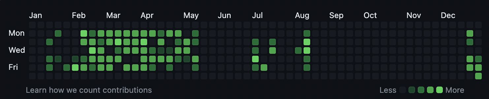
 
 
 
## 저는 불만이 많은 사람입니다

지금 생각해보면 어려서부터 상당한 수준의 불편러였던거 같네요

고등학생 때는 선생들(\*성적으로 학생들을 가르곤 했음)한테 떽떽거리고, 대학생 시절에도 어떻게든 공부말고 다른 일들 하고,,

네 맞습니다 홍대병 말기인 것 같습니다(?)

아무튼 그렇게 자라온 사람이 회사 다닌다고 달라지지는 않더라구요.

다만 어렸을 때는 뒤에서 반항하는 느낌이었다면, 지금은 생각하는 바를 조금 더 솔직하게 말할 수 있게 된 것 같습니다.

그게 모두에게 합리적으로 받아들여지지는 않았지만요,,

 
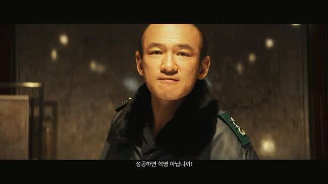
 

찡찡거리는 것처럼 보이긴 하지만(사실 맞습니다)

인사이동, 조직개편이라는 쓰나미의 크기에 비해 일개 개인의 존재는 한없이 작았습니다.

덕분에 다양한 좌절도 맛보고 술도 많이 마셨,,, ~~그건 니가 마신거 아니냐~~

 
올해 설날에 제주도에 내려갔다가(고향임)

눈이 너무 많이와서 이틀 넘게 결항이 이어져 강제로 휴가를 썼던 기억이 나는군요.

인간vs자연 구도에서 인간이 절대로 승리할 수 없는 것처럼, 개인vs회사 구도에서도 개인이 승리하기는 어렵지 않을까,,

 
 
## 우리 좋은 얘기하자! 좋은 얘기!

반면에 회사 바깥에서는 즐거운 일들이 많았습니다. 신이 있다면 삶의 난이도를 조절해주는게 아닐까 싶네욬ㅋ

처음엔 작지만 마음에 쌓여 병이 될 수 있는 일들도 미주알 고주알 말할 수 있는 사람들이 주변에 있다는건 큰 축복입니다.

그렇게 어딘가에 뱉어낼 수 있었기에 지금 이 자리에 앉아 그랬었지,, 하며 회고도 쓰고 하는거 아니겠어요?

 
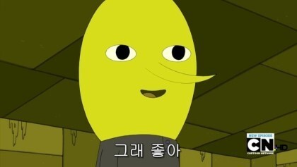
 
베트남 여행이후 거의 5년만에 해외여행도 가봤습니다. 태국 치앙마이를 갔다왔는데, 물가도
싸고 좋았습니다

튼튼발자를 추구하는 사람으로써 가장 기억에 남는건 아무래도 엄청난 크기의 야외 헬스장이 아닐까 싶네요.

하루 단 돈 60바트(2300원)로 즐길 수 있는 클럽,,

 

 

그 밖에도 아기자기하고 알록달록한 색감의 물건들이 넘쳐나는 야시장도 좋았습니다.

한국의 절반도 안되는 가격에 초호화 숙소도 가볼 수 있는 것도 매우 좋았구요 ㅎ

미쉐린 선정 카오쏘이 맛집에서 식사를 하다가, 우연히 오토바이 여행중이던 한국인 어르신 부부를 만났는데

쿨하게 저희 것까지 계산해주고 가신,, 맛있게 잘먹었습니다!

 
그리고 제가 제일 좋아하는 가수인 Honne의 내한 공연을 갔던 일도 있었네요.

처음 가본 것도 아니지만 언제가도 최고의 공연! 기회가 되신다면 꼭 한 번 가보시길 추천드립니다. (노래라도 들어보셈)

 
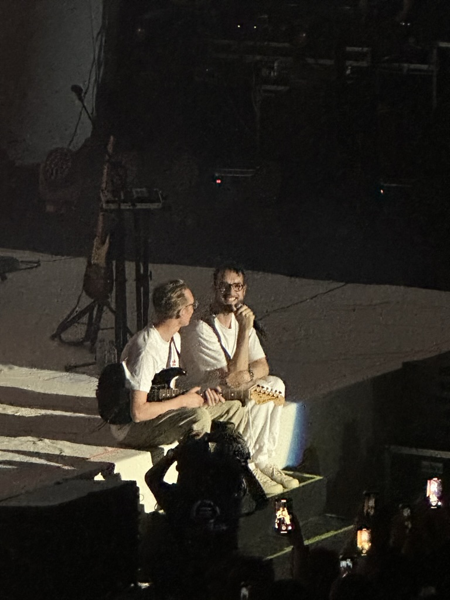
 

무튼 이렇게 회사에서의 시간과 개인적인 시간이 어찌저찌 상충되어 지나갔다고 합니다.

 
개인적으로 이런 과정에서 스스로 잘했다고 생각하는 건

- 소신있게 말하고 설득하고자 함

 
반대로 잘 못했다고 생각한 건

- 개발 실력 못키움
- 특이점 이후 소통을 포기함

이 정도로 정리할 수 있을 것 같네요.

 
 
 

# Log 2. 도망치는 것도 방법인듯

 

위에서 언급한 저 당시 제 최대 고민은 개발 실력에 대한 고민이었습니다.

사용자가 더 많은 서비스를 개발하고 싶다는 마음은 커진 반면에, 규모가 작은 개발 조차도 문서 작업에 치여 지지부진 하고 있었습니다.

이에 더해 외부 경제 상황도 안좋아져 개발 시장도 문을 닫고 있는 추세여서,

이대로 가다가는 시장에서의 내 가치를 높이지 못하는게 아닐까 하는 고민으로 이어질 수 밖에 없었습니다.

 
스트레스가 만병의 원인이라는건 다들 많이 들어서 잘 아시겠지만, 이거 ㄹㅇ인듯,,

다른 걸 다 떠나서 일에서의 만족감이 떨어지니까 퇴근하고 나서도 그냥 이래저래 무기력한 느낌이더라구요

(이와중에 다행인건 루틴의 힘으로 운동은 꾸준히함)

도파민 중독마냥 인스타그램, 유튜브 세상만 헤엄쳐다니다가 잠들기를 반복했던 것 같습니다.

 

 

그래도 죽으라는 법은 없는지 나름의 사건이 발생합니다.

타부서에서 본인들이 관리하는 프로그램의 추가기능 개발을 요청한 일이었죠.

저희 부서보단 상위에 위치하는 부서의 요청이라 거절하기도 어려웠는데,

평소 부서에서 사용하던 언어(js, python)가 아닌 java로 된 프로그램이라 지원하는 사람도 없는 상황이었습니다.

(심지어 spring boot도 아니고 spring이라니,,, 어떤 고대문서가 잠들어있는걸까 하는 두려움도 약간은 있었,,)

 
저는 새로운 도전의 기회가 주어졌을 때 이를 시도해보는 타입은 아닙니다.

당장의 문제를 주도적으로 해결하는걸 더 선호하는 편이죠.

그래서 당연하게도(개인적인 관점임) 참여할 생각이 1도 없었습니다.

 
그런데 같이 프로젝트를 많이 진행한 선배의 제안 ~~파견가서 개발하면 자유롭다!~~ 으로
다시 한 번 고민해보게 됩니다.

지금 현재의 상황을 냉정하게 지켜봤을 때 개인적인 일문일답으로 생각해본결과,

 
<업무적인 고민>

요청 내역이 상세한가? → no

MSA를 다뤄본 적이 있는가? → no

안 써본 언어을 잘 다룰 자신이 있는가? → yes

 
<업무 외적 고민>

남아서 닥친 일들을 해결한다고 상황이 나아질 것인가? → no

현재 부서에서 진행되는 일들에 불만이 있는가? → yes

 
,,,,생각보다 나쁘지 않은데,,? 라는 결론을 얻게 되었습니다.
 
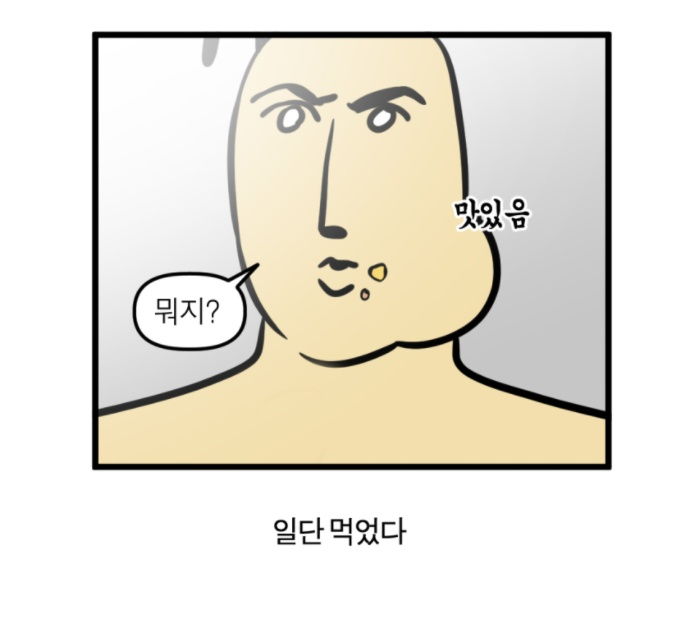
 

그렇게 10-12월 중순 2달반 동안 팀을 떠나게되는데,,,

 
시작은 늘 그렇듯이 순탄하지 않았습니다.

위에서 말씀드린 것처럼 개발 요구 사항이 명확하지 않아, 구체화 작업을 먼저 해야했습니다

관련 사용자 인터뷰부터 화면 설계, 기능 상세까지,,, 프로그램의 원 주인이 아닌 상태에서 진행하기가 여간 어려운게 아니더라구요

코드도 넘겨 받긴 했지만 마이크로 서비스로 구성된 여러개의 레포지터리들만 덜렁 받으니 이건 뭐 어쩌라는거지,,?

 
다행스럽게도 부서에서 서비스 배포 파이프라인 설계/제작을 진행했던 경험이 여기서 도움이
되더군요.

서비스를 팀에서 사용하는 개발 서버로 옮겨 동작을 테스트해보면서 각 레포지터리의 역할을 이해할 수 있었습니다.

옮기는 과정에서도 java, spring과 관련된 동작들을 많이 공부할 수 있었습니다.

spring boot 배포 경험은 있었지만, spring은 또 처음이었던지라 빌드 기초부터 다시 싹 훑어봐야했던,, ~~maven으로 빌드하는 건 함정~~

 
서비스 전체 구조를 파악하는 것도 나름 흥미로웠습니다.

MSA도 말로만 들어봤지 늘상 겪었던건 단순한 3tier 아키텍처였던지라 뜯어보고 연결시켜 보는 경험 자체가 재밌었습니다.

 
가장 재밌었던건 광화문 근처 맛집 탐방일지도?
 
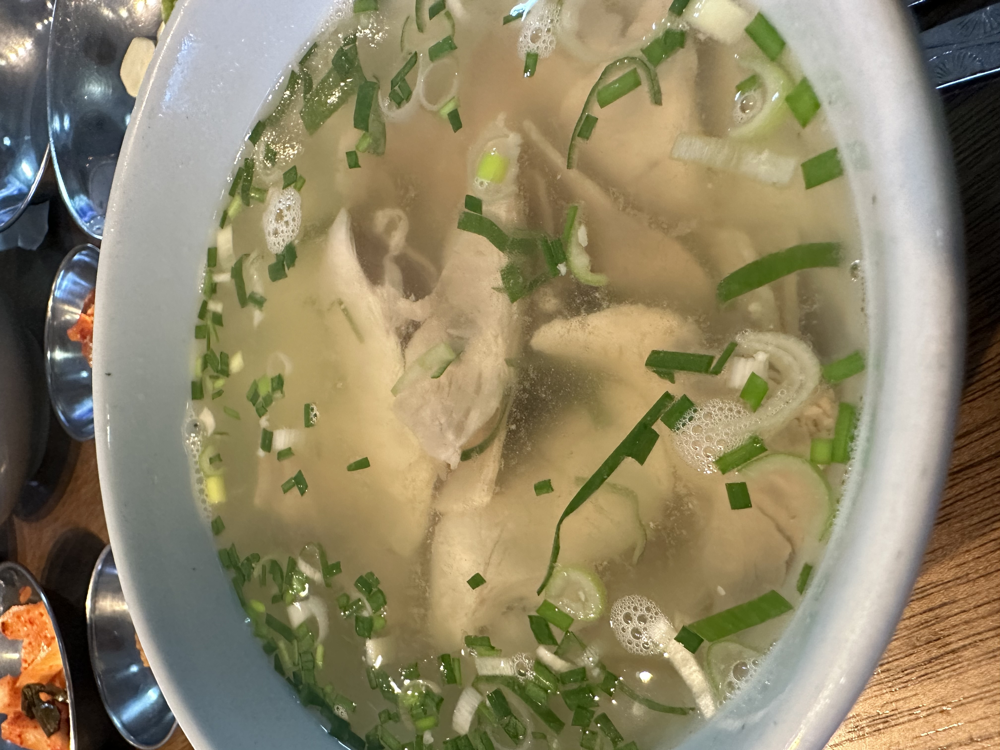
 
 

## 위기 뒤에는 기회가 생김

축구를 굉장히 즐겨보는 저로써는 이 말에 매우 공감합니다. ~~아스날 화이팅!~~

위기 상황에서 상대가 골을 성공시키지 못하면 그 다음은 우리에게 기회가 생깁니다. 이게 골로 이어지는 경우가 상당히 많죠

근데 이게 인생에서도 마찬가지일 줄이야 ㅎ

늘 기회를 떠나보내기만했던 저였지만, 이번에는 잡아봤고 맛있었습니다(?)

같이 일을 진행한 새로운 분들과도 잘 맞아서 개발 기간동안 매우 만족스러운 삶을 살았습니다 ㅎㅎ

 
그래서 때로는 이런 기회를 통해 도망쳐보는것도 삶의 만족도를 높이는 방법 중 하나가
아닐까 싶습니다.

스트레스의 근원으로부터 멀어짐으로써 다시 삶의 균형을 찾을 수 있었습니다.

 
좋았던 점은 위에서 많이 서술한 것 같으니, 이 과정에서 아쉬웠던 점만 간략히 정리하고
넘어가야겠네요.

- 감정 표출을 많이함
- 시간 낭비 많이함
- 주변사람한테 약간 틱틱댐
   
  마음이 가라앉고난 뒤에 생각해보니 제 행동을 합리화한 일이 많았던 것 같습니다.

감정을 토해내는게 편하다는 걸 깨달아버리니 주변 생각을 좀 안하게 된,, 네 맞습니다 변명입니다,,

 
유튜브를 보다가 우연히 셜록현준님이 협업에 관해 말하는 영상을 본 적이 있습니다.

‘너무 소신있는 사람이랑 일하는건 피곤하다’라고 말하시는걸 듣고 약간 띵해지는 느낌이 들었습니다.

어쩌면 소신을 지킨다고 주변에도 유연하지 못하게 대처한건 아닐까? 그렇다고 소신이 없어지는것도 별론데,,

 
그래서 내년 목표는 위로는 강하게 옆으로는 유연해지기로 정했습니다.

앞으로의 인생이 어떻게 될지는 모르지만, 지금 직업이 아니더라도 어떤 직업이든 이런 자세로 일하는게 좋을 것 같다는 생각입니다.

 
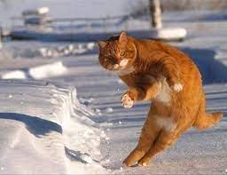
 
 
 

# Log 3. 그냥 일상얘기

 

작년이랑 다르게 글에 어두움이 좀 있는 느낌이네요,,ㅋㅋ ~~k-직장인 현실입니다~~

마지막으로는 사진첩 뒤적거리면서 뭐했는지나 좀 적어볼랍니다.

 
 
## 운동

작년에 제일 아쉬웠던게 calisthenics에 집중하지 못했던 거였는데, 이건 개선했습니다

여름에 새로운 집으로 이사하면서 집에서 운동이 가능해졌거든요 ㅎ

덕분에 좋아하던 운동에 집중할 수 있는 환경을 만들 수 있었습니다. 이제 헬스장 안가도된다!

 
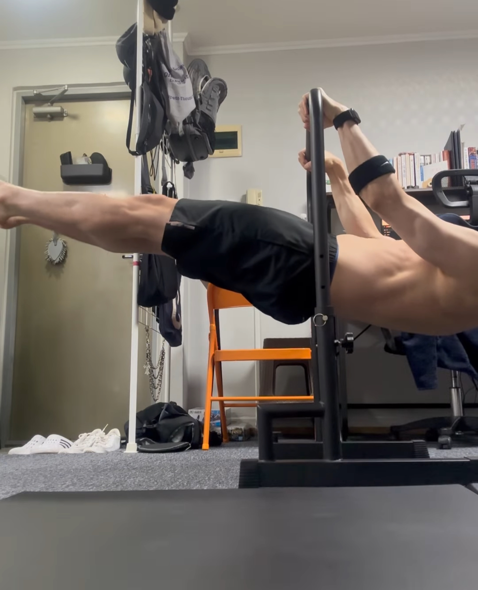

 

이제 프론트레버는 뚫었으니 다른 기술들도 정진해서 뚫어내겠습니다,,! 플란체 성공하는 그 날까지 존버,,

 
 
## 건담과 와인

놀랍게도 제 중고등학교 장래희망은, 반다이 입사였습니다. (건담프라모델 파는 회사임)

그 정도로 건담 프라모델 만드는 걸 좋아했는데, 20살 이후로는 아무래도 새로운 환경으로 바뀌고 멀어졌던 것 같아요.

용산에서 여자친구랑 놀다가 우연히 건담베이스를 갔는데, 거기서 사는 모습을 보고 다시 돌아와버린 뽐뿌,,ㅋㅋㅋ

어렸을 때와 달라진 점이라면, 돈이 생기고 정보가 많아졌다는 점?

장비가 늘고 아는게 늘어나니 더 잘 만들 수 있어짐

 
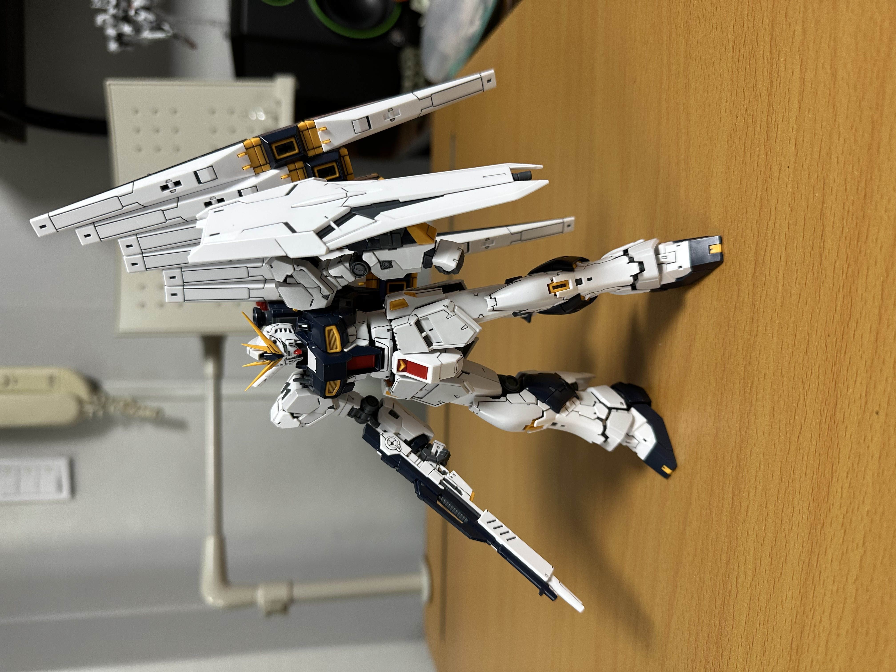
 

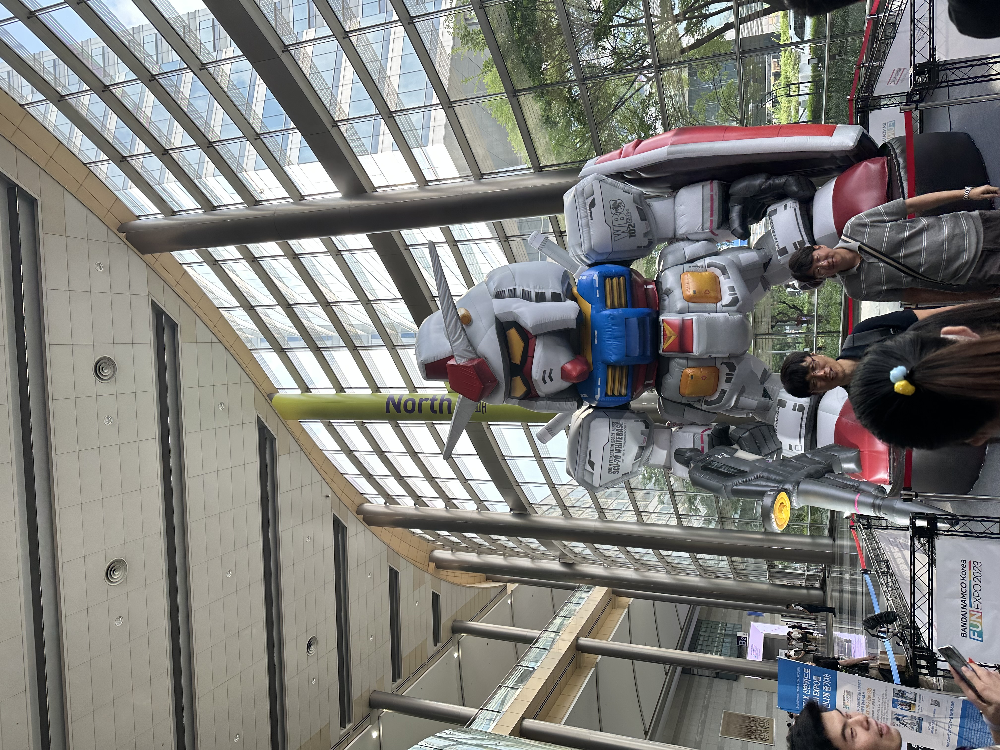

 

와인은 그냥 머,, 많이 마셨습니닼ㅋㅋㅋㅋ

종류가 어마어마하게 많으니 매번 새롭게 맛볼 수 있다는게 가장 좋은 것 같아요

가장 좋아하는 품종 정도는 생겼습니다. _피노누아가 제일 취향에 맞는듯!_

 
라이프 해킹 팁으로 가장 맛있었던 와인 추천드림
 
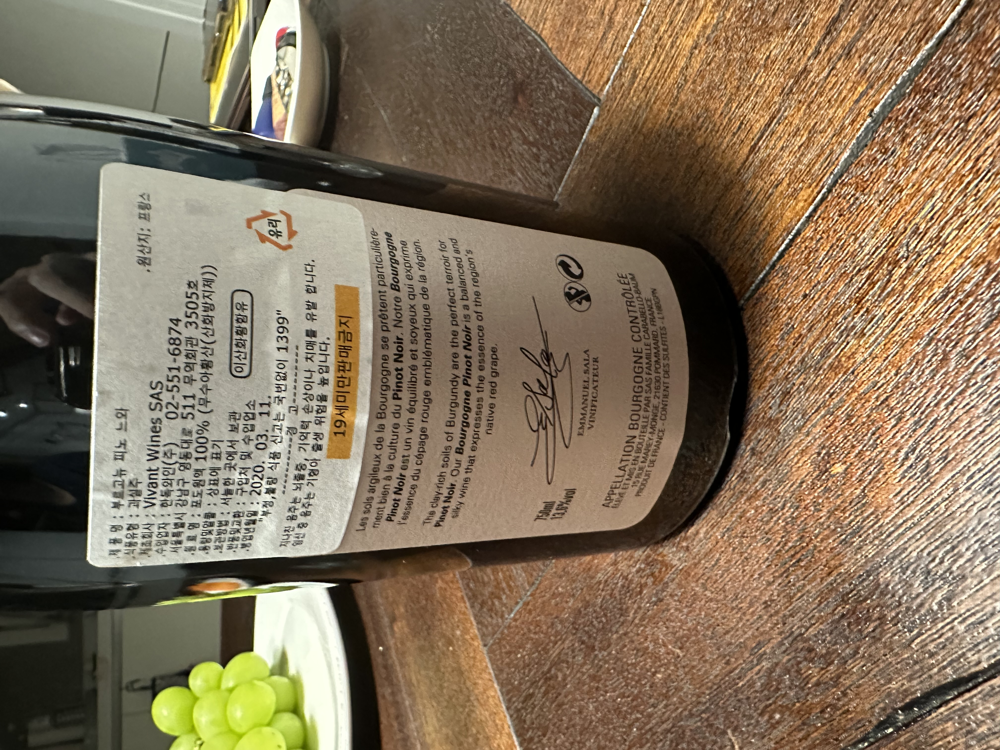

 

이제는 아예 대량 구매를 하기 시작,, 인킹이네 와인상점 추천드립니다 ㅎㅎ

 
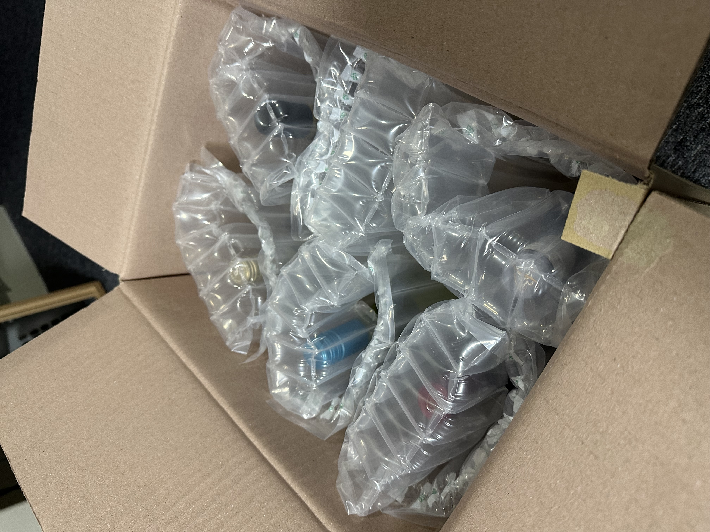

 

아오 또 쓰다보니까 길어졌네욬ㅋㅋㅋ

이제 좀 귀찮아져서 여기까지만 쓰렵니다.

 
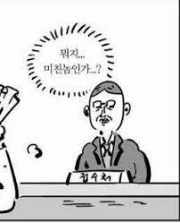

 

내년(특: 6시간 뒤임)도 어떤 일들이 생길지 기대되네요 ㅎㅎ

올 한해는 중용 유지에 어려움을 겪었다고 생각했지만, 1년 전체를 돌아보니 그렇지만도 않은 것 같네요.

앞으로도 밸런스있게 살아갈 수 있기를 기대하면서 이만 마무리하겠습니다.

 

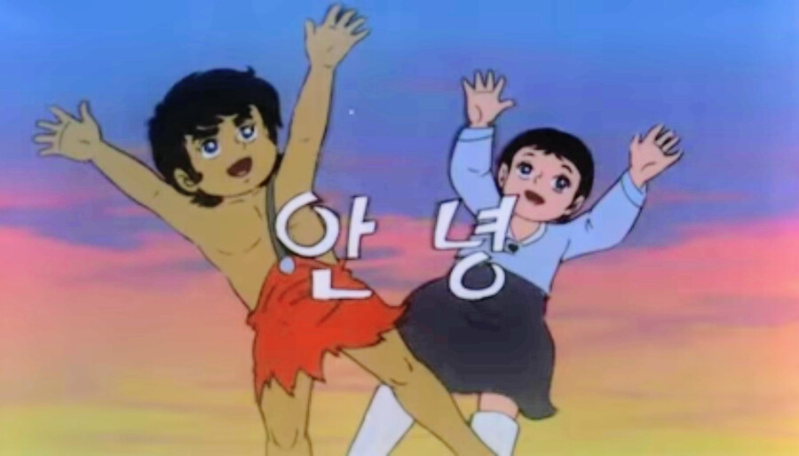
