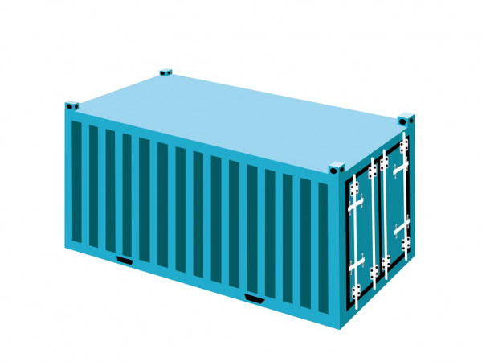

# 협업을 안해본 부서에 협업 체계 도입하기

 

 
 

시니어가 없는 신생 개발부서에 신입으로 들어와 이리 저리 구르며 도입한 내용을 정리합니다.

프로세스 각 단계마다 해당 기술을 도입한 이유와 적용 내용을 타임라인 순으로 적어보겠습니다.

 
 

## 도입 전 부서의 현황

입사 전 기대와는 다르게 IT와 전혀 관계가 없던 조직에 신설된 개발팀에 들어오게 되면서

상상과는 _많이많이_ 다른 개발 문화와 마주하였습니다.

문화 뿐만이 아니라 환경적으로도 최근 트렌드와는 거리가 멀었습니다.

기존 상황을 간략히 정리해보면,

 

1. 목적 없는 인프라 보유

 

2. 코드 공유 안됨

 

3. 개발 PM / 기획자 없음

 

4. 관리 계층 개발 지식 없음

 

지금보니까 '오 대체 어떤 곳에서 살아온거지' 하는 생각이 드네요 🤣

 

제가 처음 맡게된 업무는 사실 목표가 없는 단순 서버 관리였습니다.

AI 열풍과 함께 자체적인 모델링을 진행하겠다는 목표가 있긴 했지만,

무엇을 어떻게 모델링할지에 대한 계획이 수립되지 않은 상태에서

단 3대의 물리서버는 없는 것과 다름 없었습니다.

 

이 외에도 VM으로 구성된 개발용 서버가 1대 존재했고, 기존 직원분들은 해당 서버를 주로 사용했습니다.

시니어 급의 직원이 존재하지는 않았지만 각자가 개인이 담당하는 개발 업무를 진행해오신 분들이긴 했습니다.

다만 혼자서 오랜 시간 개발을 하다보니 각자 개발한 코드를 수동으로 서버에 퍼넘기고 실행시키는 방식이 익숙한 상태였죠

 

 

## VM에서 컨테이너로

 

그러나 팀의 규모가 커지고 프로젝트의 생성과 소멸이 잦아지면서 매번 VM을 생성하고 없애는 방식은 효율이 떨어졌습니다.

이를 개선하기 위해 우선적으로 남아도는 3대의 서버를 컨테이너 환경으로 전환하고자 했습니다.

 
 
