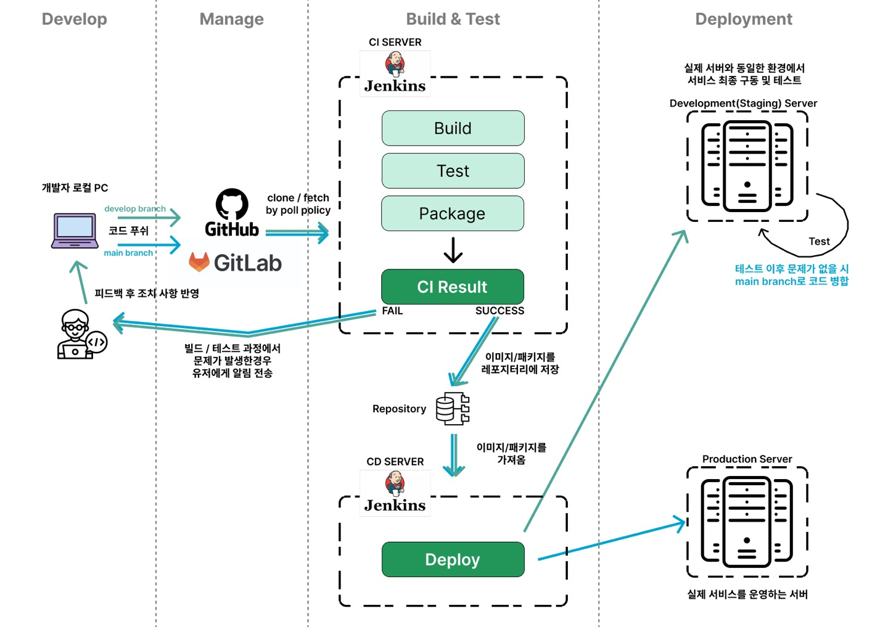
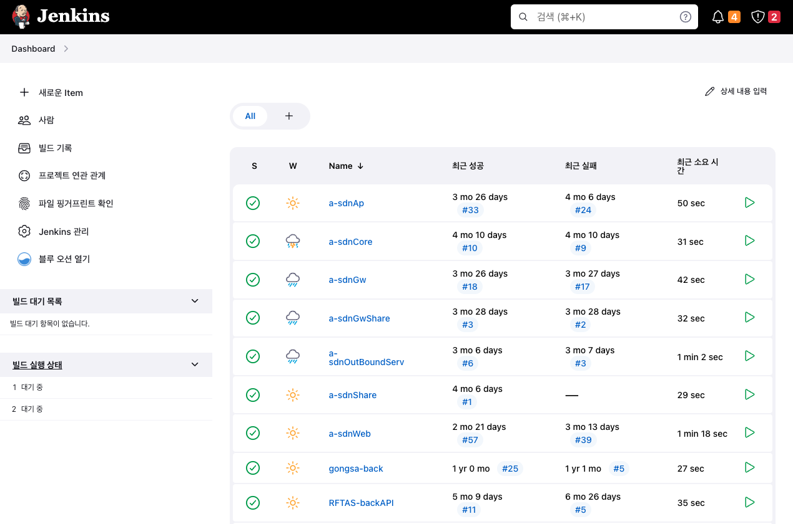

# 협업 체계 도입하기 두번째 이야기

 

 
 

### 지난 이야기,,

부서에서 놀고 있던 서버를 컨테이너화 하는데 성공하지만, 생각보다 효과는 미미했고,,

(대충 드래곤볼 지난 이야기 브금)

개발자들이 도커를 몰라도 편하게 배포할 수 있는 방법이 없을지 고민하게 되는데,,!

 
 

## 다른 회사는 어떻게 하려나

여러 고민을 하면서 제일 궁금했던건 다른 회사나 개발팀들은 어떻게 배포 환경을 구성하는가 였습니다

Agile이라던지 말은 많이 들어봤지만 겉만 열심히 핥고 실제로 어떻게 적용하는지는 전혀 모르고 있었던거죠

그래서 레퍼런스를 다양하게 찾아봤습니다.

다양한 회사의 DevRel들이 발행한 사내 개발 방식에 대한 문서들을 참고하기도하고,

저희 회사 타 부서에서 운영하는 DevOps 플랫폼들을 참고해서 어떤 식으로 동작하는지도 뜯어보고 말이죠

지금와서 생각했을 때 아쉬운점은, 다른 IT회사 실무자들이랑 커피챗이라도 했으면 좋았겠다,, 정도?

~~커피챗이 뭔지도 몰랐음~~

이 부분은 여전한 아쉬움으로 남아있습니다. ~~무슨 회사가 이리 폐쇄적인 건지 원~~

 
 

### Jenkins 도입하기

 

 

도커로 빌드된 파일을 자동으로 서버로 넘길 수 있는 방법을 찾다보니, Jenkins를 만나게 됩니다.

이걸 쓰면 자동으로 파일을 서버로 옮겨준다고? 심지어 오픈소스라 무료?

허겁지겁 개발서버에 Jenkins 컨테이너를 구동하고 기본적인 설정을 진행했습니다.

플러그인에 대해 무지했던 초반에는 좋아보이는건 무작정 다 받았다가 나중에 다 초기화한 기억이 있네요,,

자 이렇게 다 설치했으니 행복하게 살았을까요?

역시나 그건 아니었습니다.

보통은 GitHub와 같은 코드 저장소를 기반으로 코드를 가져오게 설계를 하더라구요.

뭔가 순서가 잘못된 것 같지만 ㅋㅋ 이런 사실을 통해 GitHub을 도입해서 코드 관리를 하기로 합니다.

 

- [Jenkins 설치하고 GitHub 인증 적용하기](https://www.notion.so/jun9/986ab5b957db4bb6860e0202c4fc682e?v=150d82c96b88456ca2e6ea08d75a82f2&p=dd001529bf6849d5a8fe2e0fc217fdb3&pm=s)

 
 

### GitLab도 도입하기

Jenkins와 GitHub을 도입한 뒤, 차후에 개발하는 프로젝트들은 무조건 git으로 협업하기로 정했습니다.

사실 이런 부분을 도입하는건 인프라보다는 문화적인 면에서 노력을 많이 해야하더라구요.

최근에야 git을 쓰는게 당연한 일이지만,,

기존에 개발 업무를 하시던 분들에게는 생소한 부분도 있어서,,

아직도 해결중이긴 합니다,,

다만 코드 저장소에 대한 니즈는 동일하게 존재했기 때문에 같이 사용하기로 정할 순 있었습니다.

그러나 역시 또 다른 문제가 발생합니다. 바로 사내 보안과 관련된 내용이었습니다.

 

 
 

GitHub에서 팀 생성 기능을 사용해 private하게 관리할 수는 있지만 제약사항을 해결하기 위해선 비용을 지불해야 했습니다.

또한, 사내에서 사용하는 시스템을 개발하는 경우 보안과 관련된 제약사항도 있었죠.

그래서 또다시 서칭을 해 본 결과 GitLab을 자체 서버에 설치해서 사용할 수 있다는 것을 알게되었습니다.

자체 서버에 구축한 GitLab으로 기존 프로젝트 또한 전부 이동시키고, 본격적으로 연동을 하기 시작합니다.

 

 
 

이런 전체 과정을 통틀어 CI/CD 파이프라인이라고 부르더군요.

개발자가 GitLab에 변경된 코드를 반영하면, Jenkins가 이를 감지하여 서버 내에서 빌드, 테스트, 패키징까지 실행합니다.

이렇게 생성된 결과물을 외부 또는 내부 레포지터리에 저장하여 관리하고, 배포용 Jenkins에서 이 결과물을 서버에 배포하게 됩니다.

Jenkins는 코드 변경을 감지할 때 GitLab에서 제공하는 webhook 기능을 사용합니다.

프로젝트 초기에 파이프라인을 만들면서 webhook 설정, Jenkins 설정 등을 진행해주죠.

 

- [GitLab 설치 방법과 파이프라인 연동 방법](https://www.notion.so/jun9/986ab5b957db4bb6860e0202c4fc682e?v=150d82c96b88456ca2e6ea08d75a82f2&p=f746483a718a439dbe226bb11af39e42&pm=s)

 

파이프라인이 다 만들어졌으니 이제 개발만 하면 되겠네? 그럴리가요, 아직 한 발 남았습니다.

 

설정을 다 하고나면 Jenkins가 어떻게 동작할지를 정해주어야합니다.

Jenkins를 컨트롤하는 웹에서 스크립트를 바로 입력해서 진행하는 방법도 있고,

Jenkinsfile 이라는 파일을 작성하여 이 파일을 읽어 동작하게 할 수도 있습니다.

이런 작업을 파이프라인 스크립트를 작성한다고 하며, 이 때 작성하는 스크립트는 Groovy라는 문법을 사용합니다.

저희 부서는 Jenkinsfile을 직접 작성하는 방식을 선택했습니다.

이렇게 적용된 파이프라인들은 아래 그림처럼 관리됩니다.

 

 

스크립트 작성 초기에는 미처 고려하지 못한 요소들이 많아 수많은 빌드 실패를 마주하게 됩니다.

덕분에 빌드의 평균적인 성공률을 날씨로 표현해주는 Jenkins 웹에서는 비가 주구장창 내립니다 ㅎ

 

이쯤에서 이전에 적용했던 도커 얘기를 다시 꺼내야겠군요.

사실 Jenkins는 단순히 서버에서 행하는 동작을 자동으로 실행하는 도구입니다.

그렇다면 Jenkins를 사용해서 도커를 제어할 수 있지 않을까요?

네 맞습니다. ~~대답한 적 없는데~~ Jenkinsfile에 도커를 제어하는 명령어를 작성하며 됩니다.

이를 사용하면 서버에서 이미지 빌드, 테스트, 컨테이너 생성의 모든 과정을 자동으로 진행할 수 있습니다.

드디어 개발자들이 도커를 신경쓰지 않아도 자동으로 뭔가 돌아가는 환경이 완성된 것입니다!

 

 

하지만 보이지 않는 곳에서 동작하고 있기에, 전체 프로세스에서 놓치는 부분이 많아지기도 합니다.

컨테이너가 삭제되지 않은 상태에서 이미지를 삭제하는 명령어가 실행되 jenkins가 동작을 멈춘다거나,,

컨테이너 이름이 중복된다거나,,

다양한 원인들로 빌드 실패가 발생하기에, 발생하는 케이스를 따로 잘 적어두시고 참고하는게 도움이 많이 되더군요.

 

아무튼 이런 방식으로 무사히(?) 협업 개발 체계의 일부분인 CI/CD 파이프라인을 도입할 수 있었습니다.

여기에 더해 프로젝트 관리 툴과 자동으로 연결시키면 너무나 금상첨화일 것 같다는 생각이 드시나요?

저도 그렇습니다만, 부서 사정이 또 걸림돌이 됩니다,,,

관련 이야기는 다음 이야기로,,,

아무튼 이번 글도 읽어주셔서 감사합니다! 🙇
