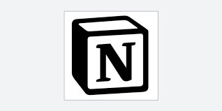

# 협업 체계 도입하기 세번째 이야기

 

 
 

### 지난 이야기,,

GitLab과 Jenkins를 통해 서버 배포 파이프라인을 구성하는데 성공하여 평화로운 나날이 지속되는듯 했지만,,

개발 편리성이 올라간 것에 비해 프로젝트 전체를 매니징하는 부분에서 부족한 부분이 많았고,

협업 체계를 고도화하기위한 도구들의 도입을 검토하기 시작하는데,,

 
 

### 이쯤에서 돌아보는 부서 현황

~~1. 목적 없는 인프라 보유~~

 

~~2. 코드 공유 안됨~~

 

**3. 개발 PM / 기획자 없음**

 

**4. 관리 계층 개발 지식 없음**

 

그래도 지금까지의 험난한(?) 과정들을 통해 몇가지 문제점들은 해결한 것 같군요.

다만 3번, 4번은 기술적으로 해결하지 못한다는 문제점이 있었습니다.

(4번은 사실상 뭐,, 그냥 포기한 거라 봅시다)

그렇다면 이제 남은 문제는 3번이군요,,

입사 전까지만 해도 제가 상상하는 개발팀의 구성은 기획자, PM, 디자이너, 개발자, 인프라 엔지니어들이 한데 어우러진 모습이었습니다만

짜잔! 현실은 전혀 아니었네요ㅋㅋ 아무래도 올드한 타입의 회사다보니까 팀장부터 그 위는 _관리자_ 라는 인식이 보통이더라구요

솔직한 말로 실무자 입장에서 보기에는 그냥 문서작업만 하는 사람들,,

 

아무튼 비관적인 말은 좀 접어두고 이런 상황을 타개하기 위해 새로운 시도를 해보려고 애썼습니다.

 
 

## 기획자 되어보기

말은 기획자 되어보기라고 했지만 사실 뭐 흉내내기에 가깝긴합니다 ㅋㅋ

요청 부서와 소통하다보면 구두로만 기능을 묘사하거나, 요구사항이 모호한 부분이 너무 많다는 애로 사항이 생기더라구요

아무래도 말로 하는 것보다는 그림으로 소통하는게 더 직관적이라는 생각이 들었습니다.

물론 협조적인 분들은 파워포인트를 사용해 엉성하게나마 의사를 전달해주시긴 했습니다.

그럼에도 개발을 완료하고 보여주니까 '내가 원하는건 이게 아닌데,,' 같은 상황이 종종 발생하였습니다.

 

문제를 해결하기 위해 서칭해본 결과, Wireframe 이라는 개념을 도입하기로 결정합니다.

개발에 들어가기 전, 러프하게 그려진 뼈대를 통해 의사를 확인하는 과정을 선행한것이죠.

이 때 사용하기로 결정한 툴이 바로 피그마입니다.

 

 
 

디자이너 정도로 뭔가를 그리거나 하지는 않더라도, 의사소통에 문제가 없을 정도는 만들어서 보여주자!

이런 생각으로 주도적으로 사용하기 시작했고, 개발 요청자가 너무 어르신만 아니라면 같이 작업하는 일도 있었습니다.

일정 수준으로는 무료로도 충분히 사용가능하다는 장점도 있었고, 배우는데 큰 노력도 들어가지 않더라구요.

외형 구조를 먼저 파악하고 있으니 차후에 프론트 코드를 작성할 때도 요소 구성에 도움이 많이 됐습니다.

단점을 꼽아보자면 음,,, 나는 누구 여긴 어디 내가 왜 이런걸 하는가 라고 생각한 점이랄까,,

 

아무튼 사용자 중심으로 화면을 구성하도록 노력하게 만든다는 건 긍정적인 점인 것 같습니다.

~~안그럼 빠꾸먹음~~

또한 피그마 도입 이후로, 무작정 개발하는 일은 줄었다는게 가장 큰 장점이 아닐까 싶습니다.

 

비루하지만 개인적으로 작업한 몇가지 결과물들을 공유합니다,,

- [어플리케이션 초안](https://www.figma.com/file/bgqRBYu4f5BMLAzky9BpQ4/%EA%B8%B4%EA%B8%89%EB%B3%B5%EA%B5%AC-%EC%B6%9C%EB%8F%99-%EC%A7%80%EC%9B%90-App?type=design&node-id=0%3A1&mode=design&t=qfaIels7toMofwYB-1)

- [웹페이지 초안](https://www.figma.com/file/4h5p0TY2PnciIertT5l9Qa/Rftas?type=design&node-id=0%3A1&mode=design&t=OFIDr4DKWV8RdwjT-1)

 
 

## 프로젝트 관리하기

이제 기획단계라는 것도 새로 생겼고, 개발만 진행하면 될 것 같은데 어떤 문제가 있었을까요?

우선 협업이 도입되면서 발생한 문제점이 있었습니다.

모두가 매일 회사에 나온다면 좋겠지만, ~~다시 생각해보니 매일 나오는건 안좋습니다~~ 그렇지가 않다는게 문제죠.

그렇기에 각자가 어디까지 개발했는지를 담당자가 없으면 알 수 없었던거죠.

그러다보니 일정에 딜레이가 생기는 일도 꽤 있었습니다.

 

한 번은 여름휴가 시즌이랑 겹쳐서 기존 개발 일정보다 두 달 이상 지연된 경우도 있었습니다.

그나마 중요도가 떨어지는 프로젝트 였기에 다행,, ~~담당자도 여름휴가 간 건 비밀~~

지금보니 여름휴가 시즌이란거에 영향을 받는다는 것 자체갘ㅋㅋㅋ 인하우스 아니면 없을 일,,ㅋㅋㅋㅋ

 

이를 해결하려고 개인적으로 사용하던 노션을 관리툴로 써보는게 어떤지 제안했습니다.

 

 
 

근데 역시나 세상은 돈이죠! 팀 계정 사용에는 돈이 들어가고 부서는 이에 인색할 수 밖에 없습니다 ㅎ

보안이라는 문제도 또 다른 걸림돌이구요.

그래도 시범적으로 도입해서 꽤나 편하게 사용했습니다.

특히 회의록 같은 걸 동시 작성할 때가 진짜 편하다는 장점이 있더라구요.

아무튼 앞서 말한 문제점들을 해결할 수 있는 새로운 툴을 찾아 헤매게됩니다.

 

그렇게 찾아낸 도구가 confluence라는 툴이었습니다.

 

 
 

보안이라는 문제도 해결할 수 있었던 이유가, 알고보니 회사에서 계약해서 사용중인게 있더라구요?

아무래도 신생팀에 회사 규모도~~규모만~~ 크다보니 해놓고도 모르는게 꽤 많은,,

덕분에 무사히 도입은 했습니다만, 작성법이 노션에 비해 어렵고 귀찮은게 많다는 단점은 있었습니다.

이게 사용률의 저하로 이어진다는 단점은 있음,,,

그래도 으쌰으쌰해서 반강제로 쓰게 하면 해결할 수 있음!

 
 

## 아~ 애자일 하고싶다

위와 같은 고민을 하다보면 애자일이 거의 이상향처럼 느껴지게 되더라구요

닿고자 하지만 닿지 않는,,, 과연 우리 팀에 적용이 가능하긴 한걸까,,?

사내 교육과정을 통해 애자일 전문가분과 많은 얘기를 할 기회가 있어서 당시 많은 궁금증을 해결한 기억이 나네요.
